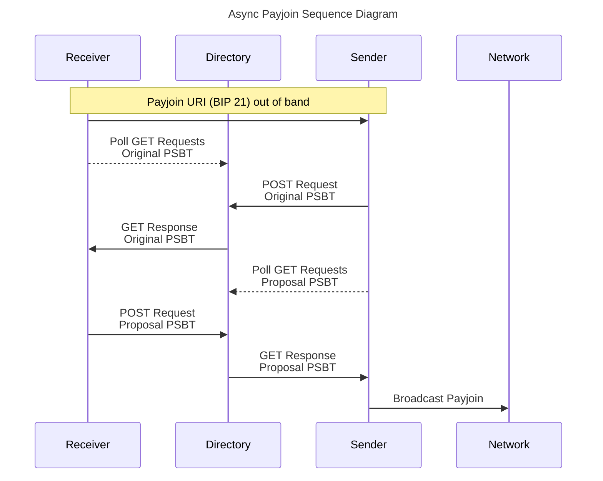

```
  BIP: 77
  Layer: Applications
  Title: Async Payjoin
  Author: Dan Gould <d@ngould.dev>
          Yuval Kogman <nothingmuch@woobling.org>
  Comments-URI: https://github.com/bitcoin/bips/wiki/Comments:BIP-0077
  Post-History: https://github.com/bitcoin/bips/pull/1483
                https://gnusha.org/pi/bitcoindev/7B11AE34-27A7-46ED-95BF-66CA13BA26F3@ngould.dev/#t
                https://gnusha.org/pi/bitcoindev/3C0A6E4C-444E-4E75-829C-1A21D8EE40E0@ngould.dev/#t
  Status: Draft
  Type: Standards Track
  Created: 2023-08-08
  License: BSD-2-Clause
  Requires: 21, 78, 173, 174
```

## Copyright

This BIP is licensed under the 2-clause BSD license.

## Abstract

Payjoin lets Bitcoin senders and receivers interact to make batched
transactions.

This document proposes a second, backwards-compatible, asynchronous version of the
Payjoin protocol described in [BIP 78](bip-0078.mediawiki). The requirement
for a receiver to host a secure public endpoint for interactions is replaced by
that of an untrusted third-party "directory" server accessed via HTTP clients that
communicate using an asynchronous protocol and authenticated, encrypted
payloads. Complete Payjoin receiver functionality, including payment
output substitution, is preserved. Authenticated encryption depends only on cryptographic
primitives available in Bitcoin Core. Requests use [Oblivious
HTTP](https://www.ietf.org/rfc/rfc9458.html) (OHTTP) to
prevent the directory and other Payjoin clients from linking requests to client
IP addresses.

## Motivation

Satoshi Nakamoto pointed out one specific privacy risk in the
[whitepaper](https://bitcoin.org/en/bitcoin-paper),
that transactions with multiple inputs "necessarily reveal that
their inputs were owned by the same owner." Payjoin enables *inputs* owned
by distinct owners to be spent in a batch. Thus, Payjoin can
address that risk which would come to be called the "common-input-ownership heuristic"
by making interactive batching practical.

While addressing Bitcoin's primal privacy risk, Payjoin *input* batching
also improves on the widespread non-interactive *output* batching practice
deployed by exchanges. When combined, the same movement of funds can use even
less block weight and so save more fees.

One might think of the Payjoin examplar combining a
transfer with a receiver consolidation into one transaction. But Payjoin
can also secure [transaction
cut-through](https://bitcointalk.org/index.php?topic=281848.0),  
allowing a sender to transfer funds to a receiver who immediately transfers
funds to third parties all in one transaction. For example, deposits to an
exchange may "cut through" a single transaction that also satisfies
withdrawals. Payjoin enables more blockspace-efficient transactions to save
transaction fees while addressing privacy risks.

However, BIP 78's Payjoin version 1 requirements have proven to be an
obstacle to adoption. Version 1 receivers must host a secured
public-facing HTTP server. Mobile and web environments limit the ability
to fulfil such a requirement. Version 1 also requires synchronous
communication. Both sender and receiver must be online simultaneously.
Wallet developers [
regard](https://lists.linuxfoundation.org/pipermail/bitcoin-dev/2021-January/018358.html)
these requirements as barriers to Payjoin adoption.

To address these limitations, our goal is to specify a practical
coordinationmechanism appropriate for widespread implementation. This proposal
leverages widespread solutions to common problems, building on established web
standards and common Bitcoin primitives.

## Overview

A Payjoin *sender* and *receiver* interact so that they may both contribute to a
transaction. To do so in version 2, they exchange asynchronous end-to-end
encrypted messages by relaying them to a store-and-forward *directory* server
using OHTTP.

Before initiating the protocol, the receiver must secure communications with
the directory by [bootstrapping](#ohttp-bootstrapping).

- The receiver [initiates a Payjoin Session](#session-initiation)
  by sharing a [Payjoin URI](#payjoin-uri) that includes its directory mailbox
  for receiving messages.
- The sender [posts a message](#sender-original-psbt-messaging)
  containing a fully signed fallback transaction, known as the *Original PSBT*,
  to the mailbox.
- The receiver gets this message and
  [posts a message containing a *Proposal
  PSBT*](#receiver-proposal-psbt-messaging)
  in response, based on the Original PSBT and including receiver
  contributions.
- The sender gets the Proposal PSBT, [checks it, signs, and
  broadcasts](#sender-signing-and-broadcast) the final transaction.

At any point, either party may choose to broadcast the
fallback transaction described by the Original PSBT instead of proceeding.

Messages are buffered in the directory, allowing both parties to tolerate
temporary disconnections and resume communication by polling.

### Sequence Diagram



## Specification

### OHTTP Bootstrapping

Before initiating a Payjoin Session a receiver must first discover the
directory's
[OHTTP Key Configuration](https://www.ietf.org/rfc/rfc9458.html#section-3.1),
via an authenticated
bootstrap mechanism. The key configuration contains information to establish
[Hybrid Public Key Encryption](#secp256k1-hybrid-public-key-encryption) (HPKE) in order to secure communications between the client and the directory in
liu of TLS.

The bootstrap mechanism may vary by implementation but must
follow [OHTTP Consistency
Requirements](https://datatracker.ietf.org/doc/html/draft-ietf-privacypass-key-consistency-01)
and should not reveal a receiver IP address to the directory. Some
examples of suitable mechanisms include getting a key configuration
from a payjoin URI, a trusted application binary, or fetching using https-in-http
CONNECT method, https-in-WebSocket, Tor, or a VPN.

Directory OHTTP Gateways MUST support [RFC 9540 Key Configuration
Fetching](https://www.rfc-editor.org/rfc/rfc9540.html#name-key-configuration-fetching)
via GET request. RFC 9540 defines the
gateway location as `/.well-known/ohttp-gateway`.

### Session Initiation

A receivers initiates a session by sharing a Payjoin URI. Because a URI
contains sensitive information, such as a receiver address, it should be shared
over a confidential channel.

#### Payjoin URI

Bitcoin URIs ([BIP
21](https://github.com/bitcoin/bips/blob/master/bip-0021.mediawiki)
or [BIP
321](https://github.com/bitcoin/bips/blob/master/bip-0321.mediawiki))
are a standard way to request bitcoin.

A Payjoin URI is a Bitcoin URI that contains a `pj` parameter. The `pj`
parameter is a URL in both BIP 78 and BIP 77.

Senders that understand Bitcoin URI but don't support Payjoin will just
ignore the `pj` parameter and proceed to typical address-based
transaction flows.

A `req-pj` parameter, as specified in BIP 21, may be used instead of
`pj` to signal that Payjoin is required.

The `pj` parameter must be [uppercased and should be the last parameter
of the URI](#uppercase-url).

Since version 1 payloads are neither encrypted nor authenticated,
a directory used for backwards-compatible payloads is known
as an ["unsecured payjoin server" in BIP 78
parlance](https://github.com/bitcoin/bips/blob/master/bip-0078.mediawiki#unsecured-payjoin-server).
backwards-compatible receivers MUST enable `pjos=0` to disable output
substitution in order to prevent modification by a malicious directory.

##### Mailbox endpoint

In Payjoin version 2 the URL in the `pj` parameter is the mailbox
endpoint URL. Mailboxes are shared HTTP resources hosted by the
directory and serve as OHTTP Target Resources. Clients use these endpoints
to relay encrypted messages. They `POST` messages to and `GET` messages from
mailbox endpoints via OHTTP.

Payjoin version 1 senders may POST messages directly to mailbox endpoints
for [backwards compatibility](#backwards-compatibility).

###### Short ID

A Short ID identifies a mailbox. The Short ID is the path component of
the mailbox endpoint. One is derived by hashing the compressed
secp256k1 mailbox public key with SHA-256, truncating it to [8 bytes
(64 bits)](#64-bit-short-id), and encoding it in
[uppercase](#uppercase-url) bech32 with no checksum and with
no HRP (also omitting the '1' separator).

##### Receiver fragment parameters

Payjoin version 2 introduces session-specific parameters which the
receiver shares encoded in the URI.

Instead of defining new Bitcoin URI parameters, the session-specific
parameters are encoded in the [
fragment](https://datatracker.ietf.org/doc/html/rfc3986#section-3.5)
of the the mailbox endpoint URL.

The `#` fragment separator character must be [RFC 3986
percent-encoded](https://datatracker.ietf.org/doc/html/rfc3986#section-2.1)
as `%23`, because it is part of the mailbox endpoint URL included in the`

`pj` parameter, not a fragment of the Bitcoin URI.

These session-specific parameters are [
uppercase](#uppercase-url) bech32 encoded, with no checksum,
and are separated by a `+` character and prefixed with HRPs according to
their role:

- `RK`: encodes the *receiver key* in compressed form. Senders will
  initiate HPKE with the receiver using this key.
- `OH`: encodes an alternate format of the OHTTP Key Configuration of
  the directory. It consists of a compressed public key of the
  directory's OHTTP Gateway, prefixed by the 2-byte Key Identifier. A [
  RFC 9458 Key
  Configuration](https://www.ietf.org/rfc/rfc9458.html#section-3.1)
  is reconstructed by assuming the HPKE KEM ID and Symmetric Algorithms
  are [fixed](#secp256k1-hybrid-public-key-encryption).
- `EX`: specifies a [session
  expiration](#session-expiration) in [unix
  time](https://pubs.opengroup.org/onlinepubs/9699919799/basedefs/V1_chap04.html#tag_04_16).

For example, a properly encoded endpoint URL fragment looks like this
`bitcoin:tb1q6q6de88mj8qkg0q5lupmpfexwnqjsr4d2gvx2p?amount=0.00666666&pjos=0&pj=HTTPS://PAYJO.IN/TXJCGKTKXLUUZ%23RK1Q0DJS3VVDXWQQTLQ8022QGXSX7ML9PHZ6EDSF6AKEWQG758JPS2EV+OH1QYPM59NK2LXXS4890SUAXXYT25Z2VAPHP0X7YEYCJXGWAG6UG9ZU6NQ+EX1WKV8CEC`

### Sender Original PSBT Messaging

The sender constructs the fallback transaction, a typical transaction
spending funds to the receiver's address specified in the Payjoin URI.
This transaction is serialized as a version 0 PSBT, satisfying
[the receiver checklist](#receivers-original-psbt-checklist).

The Original PSBT MUST:

- Include complete UTXO data.
- Be fully signed.
- Exclude unnecessary fields such as global xpubs or keypath
  information.
- Be broadcastable.

The Original PSBT MAY:

- Include outputs unrelated to the sender-receiver transfer for batching
  purposes.

This *Original PSBT* is encoded as base64, followed by the query
parameter string on a new line containing [optional sender
parameters](#optional-sender-parameters).

The sender generates an ephemeral mailbox key. Its public key is known
as the *reply key*.

This plaintext string is encrypted to the receiver key according to
[HPKE Base
mode](https://www.rfc-editor.org/rfc/rfc9180.html#name-encryption-to-a-public-key).
The HPKE `info` string, used for domain separation, is `PjV2MsgA`. The ciphertext ensures message
secrecy and integrity when passed to the receiver using the mailbox
endpoint. 


```
PjV2MsgA Byte Representation (7168 bytes total)
+---------------------------------------------------------------------------------------+
| ElligatorSwift |                             Ciphertext                               |
|   (64 bytes)   |                            (7104 bytes)                              |
|                +-----------------------+---------------------------------+------------+
|                |       Reply Key       |         Padded Plaintext        |  AEAD Tag  |
|                |       (33 bytes)      |   (7055 bytes = 7168-64-33-16)  | (16 bytes) |
+---------------------------------------------------------------------------------------+
```

The resulting HPKE payload is the body of a POST request to the
receiver's mailbox. This request is then [
encapsulated](#client-directory-interactions) according to
Oblivious HTTP to the directory's OHTTP Gateway. OHTTP serializes the
inner request as BHTTP, and provides another layer of HPKE encryption,
between the client and directory.

Upon receipt, the directory's OHTTP Gateway decapsulates the OHTTP
request and handles the inner POST request at the receiver's mailbox
endpoint, which stores the HPKE encrypted payload to be forwarded to the
receiver.

The sender then polls OHTTP encapsulated GET requests to the sender's
mailbox endpoint until it receives a response from the directory
containing the receiver's *Proposal PSBT*, and proceeds to
[sign and broadcast](#sender-signing-and-broadcast).
It stops polling after expiration.

#### Optional sender parameters

When a Payjoin sender POSTs an Original PSBT to the receiver, [BIP 78's
optional
parameters](https://github.com/bitcoin/bips/blob/master/bip-0078.mediawiki#optional-parameters)
are also valid as version 2 parameters.

HPKE binds ciphertexts to application-specific `info` strings. Because
of this domain separation, BIP 78's `v` parameter is redundant and
should be omitted for version 2.

### Receiver Messaging

After sharing the Payjoin URI with the sender, the receiver polls via
OHTTP encapsulated GET requests to the receiver's mailbox endpoint. So
long as the mailbox contains no message, the directory responds with
status 202 ACCEPTED. Once a mailbox contains a message, the directory
returns it in the response body with status 200 OK.

Upon receiving an encapsulated 200 OK response, the receiver decrypts
the payload and checks the *Original PSBT* therein according to the
[receiver checklist](#receivers-original-psbt-checklist).

The receiver then updates the *Original PSBT* to include new signed
inputs and outputs, invalidating the sender's signature(s). The receiver
may also adjust the transaction fee. The result, called the *Proposal
PSBT*, must satisfy the [sender checklist](#senders-proposal-psbt-checklist)

The Proposal PSBT MUST:

- Include all inputs from the Original PSBT.
- Include all outputs which do not belong to the receiver from the
  Original PSBT.
- Include complete UTXO data.
- Insert additional inputs and outputs at a random index.

The Proposal PSBT sender MAY:

- Add, remove or modify Original PSBT outputs under the control of the
  receiver (i.e. not sender change).

The Proposal PSBT MUST NOT:

- Shuffle the order of inputs or outputs contained in the Original PSBT.
- Decrease the absolute fee of the Original PSBT.

The receiver encrypts the *Proposal PSBT* to the sender's reply key
according to [HPKE Auth
mode](https://www.rfc-editor.org/rfc/rfc9180.html#name-authentication-using-an-asy). The HPKE `info` string is `PjV2MsgB`.

```
PjV2MsgB Byte Representation (7168 bytes total)
+---------------------------------------------------------------------------------------+
| ElligatorSwift |                             Ciphertext                               |
|   (64 bytes)   |                            (7104 bytes)                              |
|                +---------------------------------------------------------+------------+
|                |           Padded Plaintext                              |  AEAD Tag  |
|                |       (7088 bytes = 7168-64-16)                         | (16 bytes) |
+---------------------------------------------------------------------------------------+
```

The receiver makes the resulting HPKE payload the body of a POST request to the
sender's mailbox whose Short ID is derived from the sender's reply key. This request is then [
encapsulated](#client-directory-interactions) according to
Oblivious HTTP to the directory's OHTTP Gateway. OHTTP serializes the
inner request as BHTTP, and provides another layer of HPKE encryption,
between the client and directory.

Once the receiver makes this request, they wait for either transaction from the
Original PSBT or Proposal PSBT to be broadcast to the Bitcoin network.

#### Receiver's Original PSBT checklist

The receiver checklist is the same as the [the BIP 78 receiver
checklist](https://github.com/bitcoin/bips/blob/master/bip-0078.mediawiki#receivers-original-psbt-checklist).

### Sender signing and broadcast

The sender validates the *Proposal PSBT* it receives against a
checklist. If the checks pass, it may sign and broadcast the resulting
payjoin transaction.

#### Sender's Proposal PSBT checklist

The version 2 sender's checklist is the same as the [the BIP 78 sender
checklist](https://github.com/bitcoin/bips/blob/master/bip-0078.mediawiki#senders-payjoin-proposal-checklist).

### Client/Directory interactions

The Payjoin Directory provides a rendezvous point for senders and
receivers to exchange messages. The directory stores Payjoin payloads to
support asynchronous communication. Payjoin version 2 requests must be
submitted as encapsulated messages to the directory's OHTTP Gateway.

```
OHTTP Encapsulated Message Byte Representation (8192 bytes total)
+-----------------------------------------------------------------------------------+
|         HPKE KEM        | OHTTP Header |               Ciphertext                 |
| Uncompressed Public Key |  (7 bytes)   |        (8120 bytes = 8192-65-7)          +
|        (65 bytes)       |              +-----------------------------+------------+
|                         |              |     Padded BHTTP Request    |  AEAD Tag  |
|                         |              | (8104 bytes = 8192-65-16-7) | (16 bytes) |
+-----------------------------------------------------------------------------------+
```

GET requests on an empty mailbox should block until a message is posted
or a timeout occurs. The timeout should be 30 seconds because that will
not exceed the default timeout for most HTTP clients.

The directory may optionally accept HTTP/1.1 POST requests without OHTTP
to mailbox endpoint URLs for backwards compatibility with Payjoin
version 1 senders.

#### OHTTP Sequence Diagram


### Relay/Directory interactions

RFC 9458 requires each OHTTP Relay to be configured to forward requests
to exactly one OHTTP Gateway. This requirement prevents receivers from
being able to choose any directory, and senders from choosing relays
independently. Without addressing this limitation, senders would have to
know which relays are appropriate to use for each directory, creating a
tendency for one directory and its affiliated relays to monopolize the
Payjoin version 2 protocol.

In order to allow OHTTP Relays to be used with any directory, a
directory's OHTTP Gateway may advertise this allowed purpose. When the
directory receives a GET request to the `/.well-known/ohttp-gateway`
path with an `allowed_purposes` query parameter, its response body
should contain a magic string in the same format as a TLS ALPN protocol
list (a U16BE length encoded list of U8 length encoded strings). The
magic string is `BIP77 454403bb-9f7b-4385-b31f-acd2dae20b7e`, offering
an unambiguous signal to relays that this OHTTP Gateway will accept
requests associated with this purpose from any relay.

By supporting this `allowed_purposes` parameter, the directory signals
to OHTTP Relays that it is willing to handle requests related to BIP 77
Payjoin version 2, removing the RFC 9458's requirement that relays and
Gateways be configured in a one-to-one relationship.

## Rationale

### Uppercase URL

In order to simplify parsing and allow QR encoders to use [Alphanumeric
QR
mode](https://www.rfc-editor.org/rfc/rfc9285.html#name-the-alphabet-used-in-base45),
which is more compact than Byte mode, the mailbox endpoint URL,
including the fragment parameters, is encoded in uppercase.

Unlike Bitcoin URI parameters, which require switching back to Byte
mode, the use of the URL fragment for session-specific parameters makes
it possible to stay in Alphanumeric mode.

The `pj` parameter mailbox endpoint URL SHOULD be the last Bitcoin URI
parameter to avoid QR mode switching.

### Session Expiration

The directory may hold a message for an offline payjoin peer until that
peer comes online. However, the BIP 78 spec [
recommends](https://github.com/bitcoin/bips/blob/master/bip-0078.mediawiki#receiver-does-not-need-to-be-a-full-node)
broadcasting Original PSBTs in the case of an offline counterparty.
Doing so exposes a naïve, surveillance-vulnerable transaction which
Payjoin intends to avoid.

Because BIP 78 is a synchronous protocol without a standard expiration
mechanism, and automated receivers are vulnerable to probing attacks,
BIP 78 encourages receivers to broadcast the Original PSBT after some
undefined expiration time.

Because BIP 77 is an asynchronous protocol, it requires an explicit [
session-specific fragment
parameter](#receiver-fragment-parameters), `EX`, to
communicate this expiration time to the sender.

There is no way for a sender to prevent a receiver from broadcasting the
fallback transaction extracted from the Original PSBT before the
receiver-specified expiration time.

### 64-bit Short ID Length

64 bits are sufficient to make the probability of experiencing a random
collision negligible. As of writing, the UTXO set has ~2^28 elements.
This is a very loose upper bound for the number of concurrent (non-spam)
sessions, for which the probability of a random collision will be less
than 1%. The actual number of sessions will of course be (orders of
magnitudes) lower given that session are short lived. With ~2^21
sessions (a loose bound on number of transactions that can be confirmed
in 24 hours) the probability is less than 1e-6. These figures bound the
probability of a collision existing anywhere in the entire set, whereas
the probability for an individual session to experience a collision is
\<\< 1e-10 in either case.

### Complete UTXO Data

Complete UTXO data is required because this information is required for
signing some input types.

### HTTP

HTTP is ubiquitous. Using simple HTTP polling allows even Bitcoin Core
to consider an implementation. Unlike a WebSockets protocol, plain HTTP
can benefit from metadata protection by using Oblivious HTTP.

### Oblivious HTTP

OHTTP protects sender and receiver IP addresses both from one another
and from the directory. This makes it more difficult for a directory to
correlate many payjoin transactions with specific IP addresses.

OHTTP relays can be run as basic HTTP proxies from wallet providers or
third parties.

### Uniform Payloads

Encapsulated OHTTP payloads seen by the relay and directory, and
encrypted messages seen by the directory, are constructed to be uniform
so that these third-party services are unable to distinguish between
them.

Encapsulated OHTTP messages are 8192 bytes long, and begin with a
cleartext OHTTP header and an uncompressed key which is distinguishable
from random bytes but uniform across different encapsulated requests.

End-to-end encrypted messages are 7168 bytes long, and should be
indistinguishable from uniformly random bytes. Elligator swift is used
to encode encapsulated HPKE public keys prepended to the HPKE ciphertext
so that the directory can't distinguish between key material, the
ciphertext, and randomness. This ensures the two different protocol
messages are indistinguishable from each other as well as any protocol
extensions.

These padded sizes are sufficient for most PSBTs without exceeding the [
8KB
limit](https://www.geekersdigest.com/max-http-request-header-size-server-comparison/)
of many HTTP/1.1 web servers. 8KB is also too small for image sharing,
making misuse of the directory impractical.

### Secp256k1 Hybrid Public Key Encryption

[RFC 9180 Hybrid Public Key
Encryption](https://www.rfc-editor.org/rfc/rfc9180.html)
(HPKE) is a modern IETF standard for secure
message exchange without TLS, which is not available in Bitcoin Core.

Payjoin version 2 uses `DHKEM(Secp256k1, HKDF-SHA256)` and
`ChaCha20Poly1305` AEAD for both OHTTP encapsulation and for end-to-end
encryption between the sender and receiver.

The receiver transmits its receiver key in [receiver fragment
parameters](#receiver-fragment-parameters). The sender shares
its reply key along with the Original PSBT. These keys are ephemeral and
must only be used for a single Payjoin Session.

#### Secp256k1-based DHKEM

[Secp256k1-based DHKEM for
HPKE](https://www.ietf.org/archive/id/draft-wahby-cfrg-hpke-kem-secp256k1-01.html)
is most appropriate because of secp256k1's availability in bitcoin
contexts.

#### ChaCha20Poly1305 AEAD

This authenticated encryption with additional data [
algorithm](https://en.wikipedia.org/wiki/ChaCha20-Poly1305)
is standardized in [RFC
8439](https://www.rfc-editor.org/rfc/rfc8439) and has high
performance. ChaCha20Poly1305 AEAD has been implemented [in Bitcoin
Core](https://github.com/bitcoin/bitcoin/pull/15649) for [
BIP 324 Encrypted
Transport](https://github.com/bitcoin/bips/blob/master/bip-0324.mediawiki)
as well. This has widespread support in browsers and common
cryptographic libraries. AES-GCM is more widespread but is both older,
slower, and not typically already a dependency in bitcoin software.

#### HKDF-SHA256

SHA-256 is necessarily available in bitcoin contexts.

## Attack vectors

In addition to the attack vectors and mitigations in [BIP 78 Payjoin
version
1](https://github.com/bitcoin/bips/blob/master/bip-0078._mediawiki#attack-vectors),
Payjoin version 2 has the following attack vectors.

### Directory Denial of Service

Since each mailbox stores arbitrary encrypted payloads, directories are
vulnerable to flooding. To mitigate such denial of service attacks,
directory operators may respond with `401` unauthorized unless an
authorization token is provided. Authorization tokens must be unlinkable
to preserve client privacy. A specific unlinkable authorization token
mechanism is out of the scope of this proposal.

### Network privacy

Oblivious HTTP must be used to protect the IP addresses of both sender
and receiver from the directory. This requires an OHTTP Key
Configuration to be shared in the Payjoin URI and for the directory to
support Oblivious HTTP.

Unlike BIP 78 implementations, sender and receiver peers will only see
the IP address of the directory and not that of their peers.

Senders which submit requests directly to the directory, without using
an OHTTP Relay, may reveal their IP address to the receiver since that
receiver also specifies the directory.

## Backwards compatibility

Senders not supporting Payjoin will just ignore the `pj` parameter and
proceed to typical address-based transaction flows.

All payjoin versions use [bitcoin URIs](#payjoin-uri).
Receivers may choose to accept version 1 payloads at their discretion.

A version 1 sender posts their request to the directory, which stores
and forwards it to the version 2 receiver. A backwards compatible
receiver proceeds with the version 1 checks if the encapsulated response
body is UTF-8 plaintext, signifying version 1. In order to service the
request, a version 1 response must be returned to the sender within 30
seconds or else the directory should respond with an `unavailable` JSON
error code as [defined in BIP
78](https://github.com/bitcoin/bips/blob/master/bip-0078.mediawiki#receivers-well-known-errors).

## Reference implementation

A production reference implementation client can be found at
<https://crates.io/crates/payjoin-cli>. Source code for the clients, the
directory, and development kit may be found here:
<https://github.com/payjoin/rust-payjoin>. Source code for an Oblivious
HTTP relay implementation may be found here
<https://github.com/payjoin/ohttp-relay>.
