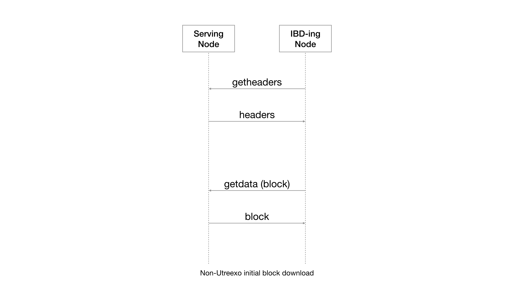
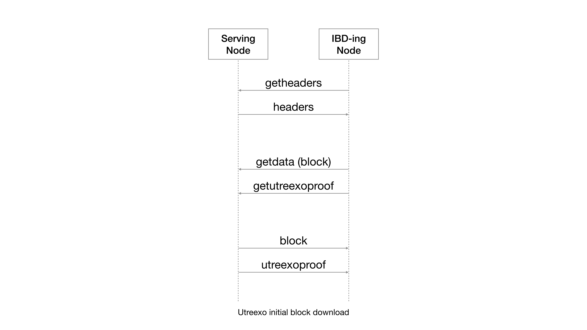
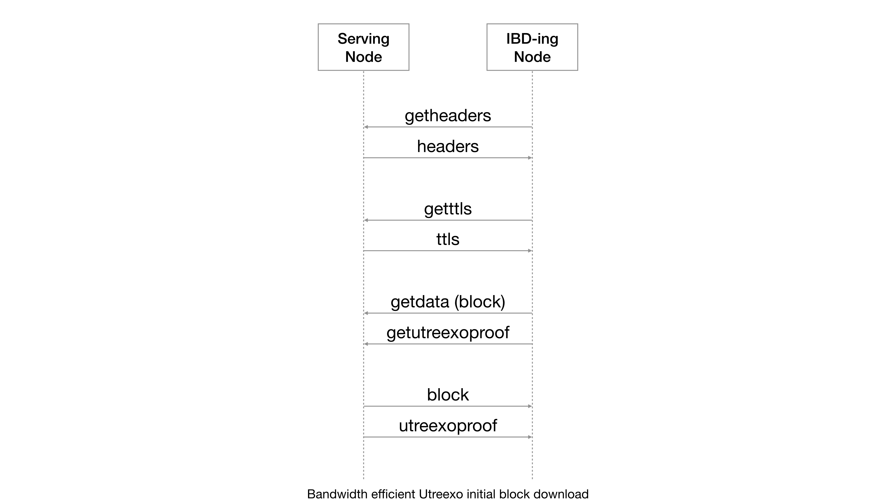
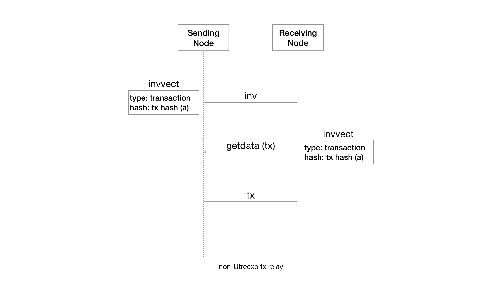
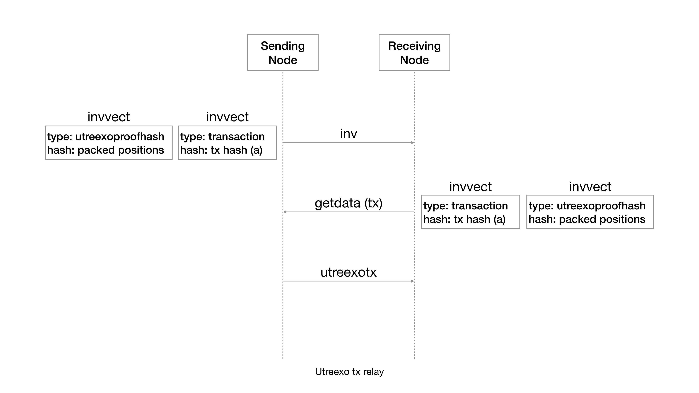
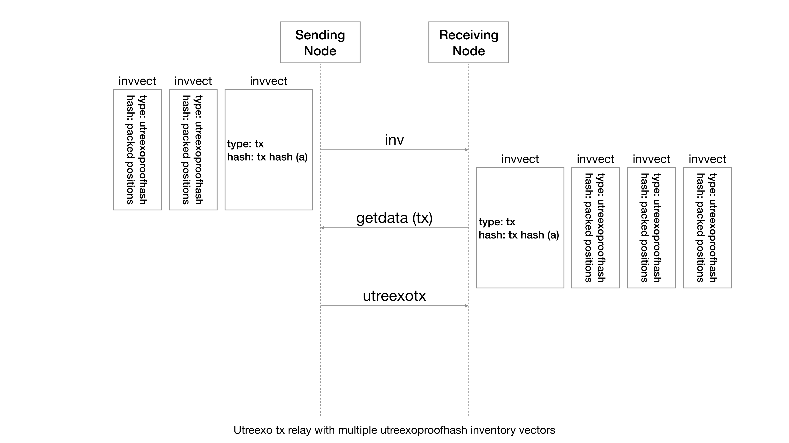
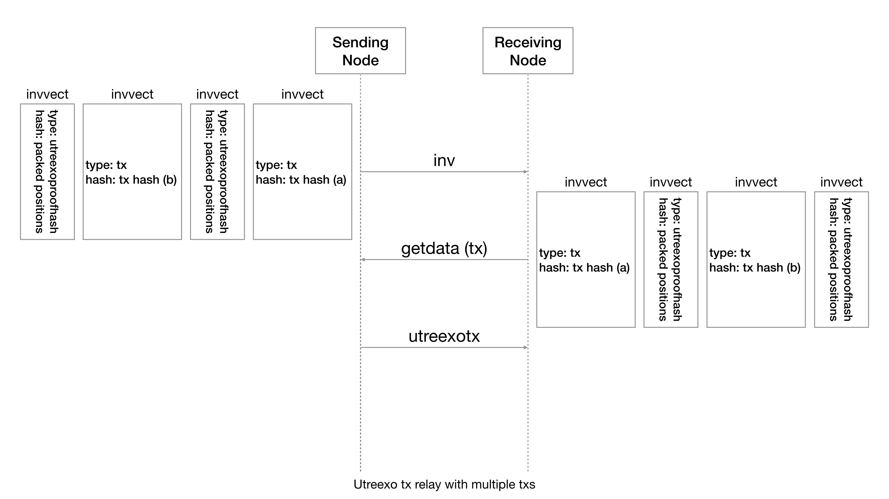
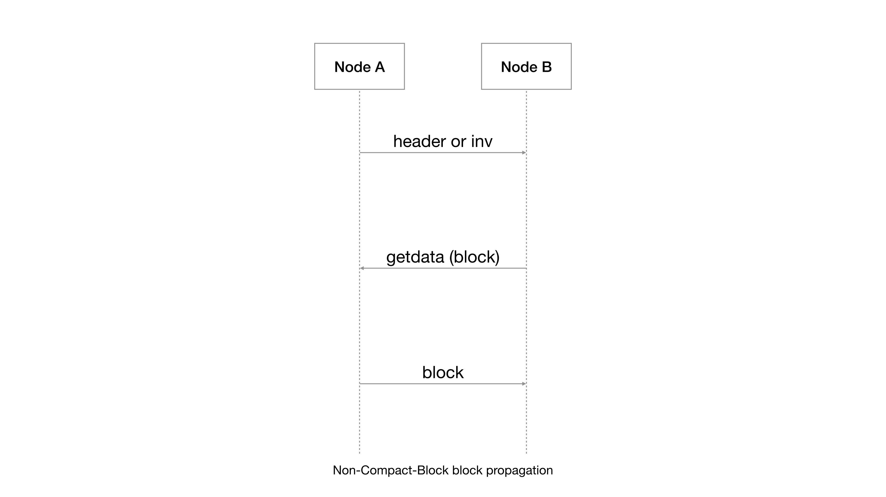
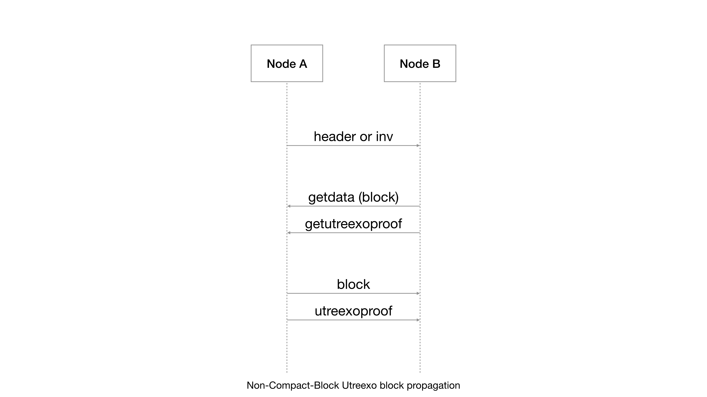
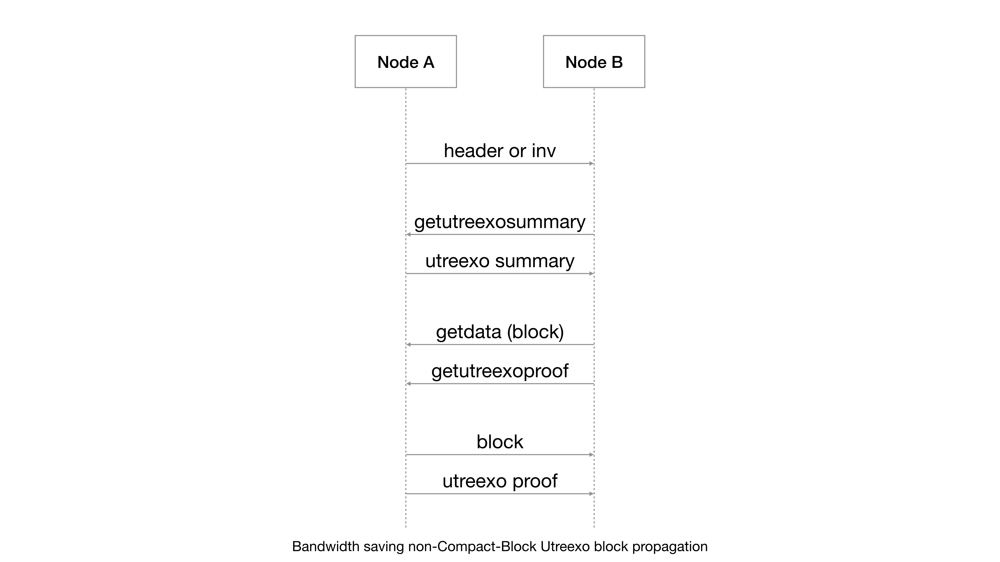

```
  BIP: 183
  Layer: Peer Services
  Title: Utreexo - Peer Services
  Author: Tadge Dryja <rx@awsomnet.org>
          Calvin Kim <bip@calvinkim.info>
          Davidson Souza <bip@dlsouza.dev>
  Comments-URI: https://github.com/bitcoin/bips/wiki/Comments:BIP-0183
  Status: Draft
  Type: Standards Track
  Created: 2024-08-08
  License: BSD-3-Clause
  Requires: 181, 182
```

## Abstract

Utreexo creates a compact representation of the UTXO set that only takes a couple of kilobytes.
When spending a transaction, one must provide an inclusion proof for the UTXOs being spent.
This BIP defines the networking-layer changes needed to allow nodes to exchange the inclusion proofs.
This document **does not** describe how to validate blocks and transactions using the provided data, see [BIP-0182](bip-0182.md) for more details.

## Motivation

Utreexo nodes require the inclusion proof to fully validate blocks and transactions.
Each block has a corresponding inclusion proof with it and this inclusion proof for blocks up to height 906,937 requires an additional 631.85GB, which is roughly 40GB less than the size of the block data.
Each transaction also has a corresponding inclusion proof with it and for normal transaction relay, the proof is roughly 3 times the size of the transaction.
It's still reasonable for a single node to download this extra data but a little caching goes a long way in reducing the amount of data that one has to download.
We define the new P2P messages for the inclusion proofs to support caching to reduce bandwidth while also allowing a high bandwidth, low-latency usage.

## License

This BIP is licensed under the BSD-3-Clause license.

## Overview

### Requirements and Compatibility

Nodes implementing Utreexo can choose which messages to support.
There are a number of configurations possible, and this BIP does not restrict nodes to any subsets of messages.

That said, there are three likely types of nodes:
1. Compact State Nodes (CSNs)
2. Bridge nodes
3. Archive nodes

CSNs have the goal of minimizing data storage and download while performing block validation.
Archive and bridge nodes store more data and provide this data to CSNs.

Bridge nodes are nodes that can add inclusion proofs to mempool transactions, support the same set of messages as CSNs, and should in fact be indistinguishable from CSNs on the network.
Archive nodes are able to serve the blocks and the inclusion proofs. However, they are not able to generate the inclusion proofs as they do not keep the full UTXO set.

Note that the archive and bridge capabilities of a node are separate; a bridge node can be bridge only, without previous block proof data, and an archive node doesn't need to be able to bridge.

The one exception to this flexibility is that archive nodes must provide both the blocks and the inclusion proofs.
While theoretically possible to split these two resources, the blocks are quite small relative to the block proofs, and it simplifies clients to be able to rely on being able to request both over the same connection.

### Pre-P2P: Bridge Building

When introducing Utreexo into an existing network, there are two things needed before CSNs can operate.
First, archive nodes need to build proofs for old blocks to serve during the initial block download (IBD).
Second, nodes need to build and maintain the UTXO merkle forest, and an index of outpoints to leaves of that forest, so that they can build proofs for new transactions.
Both of these processes happen without any p2p messages by taking an already existing, synchronized archive full node and going through its stored block data.

Once an archive and bridge node have been established, CSNs download blocks and inclusion proofs to IBD and maintain sync with the bitcoin network. 

### Initial Block Download

Conventionally, IBD is done by a headers-first block download, in which the node downloads all the Bitcoin block headers, verifies that they connect, and follows up by by downloading the block data for validation.

Below image illustrates how a non-Utreexo node would perform the IBD.



Utreexo nodes still perform the headers-first phase.
However, in addition to blocks, they also require the inclusion proof for UTXOs spent in that block.
Hence, a Utreexo node will send a `getutreexoproof` message along with the `getdata` message for a given block.
This flow is the simplest change and allows a Utreexo node to validate and perform IBD but this method does require downloading about two times as much data as a conventional node due to the inclusion proof for a block being roughly the same size as the block itself.

Below image illustrates how a Utreexo node would perform the IBD.



For Utreexo nodes with memory to spare, we introduce a `TTL` message that will have a time-to-live value for each of the outputs in a given block.

With these TTL values, a node receiving the `TTL` message will be able to determine which output to cache with the Clairvoyant algorithm[^1] which allows the IBD-ing node to reduce the bandwidth required in syncing the node in the most efficient way possible.

The node will have the block and the TTLs for the outputs of the given block which it can then use to cache parts of the inclusion proof and only request the needed parts of an inclusion proof for future blocks.

We note that it is feasible for a node to receive incorrect TTL values from malicious nodes and this can negatively impact the bandwidth savings.
This can be mitigated by either:

1. Avoiding downloading TTL values for blocks too far into the future since the damage done will be greater.
2. Rely on the pre-committed *TTL accumulator* in the node software.
   The TTL accumulator has TTLs for each of the blocks accumulated.
   With this accumulator, the node can check if the received TTL value is valid or invalid by checking for its existence in the TTL accumulator.

The TTL accumulator is described in detail in the section [Commitment scheme for TTL messages](#commitment-scheme-for-ttl-messages) below.

Below image illustrates how a Utreexo node would perform a bandwidth efficient IBD.



### Transaction relay

Non-Utreexo transaction relay is done by sending an inv message with the hash of the transaction and a type field that denotes that this hash represents a transaction.
If the node receiving the inv does not have a transaction matching that hash, the node then requests the transaction using a getdata message.

Below image illustrates how a non-Utreexo node would relay transactions.



The transaction relay for Utreexo nodes doesn't add any extra round trips.
However, it does include extra inventory vectors in the inv message.

We introduce a new inventory vector type called `utreexoproofhash`, which makes up the extra information that a Utreexo node will receive.

A hash with the type `utreexoproofhash` represents four Utreexo merkle tree positions, each of them little-endian serialized and taking up 8 bytes in the 32-byte hash.
When sending an inv message to a Utreexo node for a transaction, we append `utreexoproofhash` inventory vectors to represent the merkle tree positions for each of the UTXOs being referenced in the inputs of the transaction.
The Utreexo merkle tree positions are explained in detail in [Utreexo Accumulator Specification](bip-0181#Merkle Forest).
Since the hash in an inventory vector is always 32 bytes, any unused space will be padded with the max uint64 value of 18446744073709551615.

With these merkle tree positions for the UTXOs referenced in the inputs, we can calculate the needed positions of the merkle hashes to them.
These positions are then sent over in the `getdata` message as an another inventory vector.

Below image illustrates how a Utreexo node would relay transactions.



There may be cases where the transaction is referencing more than 4 merkle positions.
In this case, the extra positions are added as another inventory vector.
There can be as many additional inventory vectors for the `utreexoproofhash`es as needed.
An inventory vector of type `utreexoproofhash` will be ignored if it's not prepended with an inventory vector of type `transaction`.

Below image illustrates how a Utreexo node would relay transactions with multiple inventory vectors of the type `utreexoproofhash`.



It's possible to have an inv message with multiple txs as well.
Note that an inventory vector of type `utreexoproofhash` MUST be appended to the `tx` inventory vector.

Below image illustrates how a Utreexo node would relay multiple transactions.



### Block Propagation

Legacy block propagation without Compact Blocks comprises of three steps:

1. Node A sends an inv message or a block header to Node B.
2. Node B makes a getdata request for the block.
3. Node A sends the block data to Node B.

Below image illustrates how a non-Utreexo node would relay blocks without using Compact Blocks.



The same block propagation with Utreexo nodes will look like so:

1. Node A sends an inv message or a block header to Node B.
2. Node B makes a getdata request for the block.
3. Node B makes a getutreexoproof request for the block.
4. Node A sends the block data to Node B.
5. Node A sends the inclusion proof to Node B.

Note that while Node A sent the inv or the blockhash to Node B, Node B is free to ask for the Utreexo proof from a node other than Node A.
This allows a Utreexo node to be notified of new blocks from non-Utreexo nodes.

Since there's no PoW required for the inclusion proof, the block may be valid and the proof may be invalid.
If the block header validation passed while the full block validation fails, Node B should request the inclusion proof from a different peer.
If the new proof and the block pass validation, we can conclude that Node A is malicious and ban the peer.

Below image illustrates how a Utreexo node would relay blocks without using Compact Blocks.



Since the inclusion proof is cached for each of the transaction in the mempool, it's possible to omit the proof hashes for the input UTXOs that we can already prove on our own.
This method looks like so:

1. Node A sends an inv message or a block header to Node B.
2. Node B makes a getdata request (MSG_UTREEXO_SUMMARY) for the given blockhash.
3. Node A sends the utreexoblocksummary message to Node B.
4. Node B calculates which proof hashes and leafdatas it needs to prove this block.
5. Node B makes a getdata request for the block to Node A.
6. Node B makes a getutreexoproof request for the block to Node A.
7. Node A sends the block data to Node B.
8. Node A sends the requested inclusion proof data to Node B.

As with the getutreexoproof message, Node B is free to ask for the utreexoblocksummary message from a node other than Node A.
Since there's no commitment to anything in a utreexoblocksummary message, the information given in it can be false.
Should the block fail to validate with this propagation, Node B should request the full proof from a different peer.
Should the proof and the block pass validation, we can conclude that Node A is malicious and ban the peer.

All of the above propagation works the same with Compact Block propagation as well.
The requester would need to send a getdata request (MSG_UTREEXO_SUMMARY) after the Compact Block propagation has concluded for high-bandwidth Compact Block propagation and after the header/inv message was received from the broadcasting peer.

Below image illustrates how a Utreexo node would relay blocks in a bandwidth efficient manner without using Compact Blocks.



## Specification

Several new data structures and messages are introduced to make the IBD and tx relay possible.
All structures are little-endian encoded unless otherwise noted.

### New data structures

#### Compact leaf data

For a CSN to learn the data associated with a UTXO, it must ask for it from a peer that has it.
To authenticate this data, it is committed into the accumulator, and therefore cannot be changed by the peer.
The committed data is defined in [Utreexo - Transaction and block validation](bip-0182#UTXO Hash Preimages), but for some information in the leaf data, the receiving peer might already have it, so sending it again is a waste of bandwidth.
To save that bandwidth, we only send a Compact Leaf Data, that contains all missing information for the receiving peer to reconstruct the full leaf data.
A compact leaf data is defined as:

| Field        | type                         | Description     |
|--------------|------------------------------|-----------------|
| header code  | uint32                       | This is a value obtained by left shifting the block height that confirmed this transaction, and then OR-ing it with 1, only if this transaction is a coinbase. |
| amount       | int64                        | The amount in sats locked on this output |
| scriptPubkey | reconstructable scriptPubkey | The scriptPubkey in a reconstructable format, see [Reconstructable Script](#Reconstructable-Script) for more details |

#### Reconstructable Script

For some script types (e.g. `ScriptHash`, `PubkeyHash`, `WitnessScriptHash`, `WitnessPubkeyHash`) the actual locking condition is not in the scriptPubkey, but a hash of it.
The script which is evaluated is provided as an element of the scriptSig or witness data.

Therefore, we can safely omit the locking script hash from the UTXO data and reconstruct it from the witness or scriptSig.

A Reconstructable Script is a tagged union that lets nodes recreate the script without necessarily providing redundant information.
If we can reconstruct the committed hash from the transaction data, we just say which type should we expect.
Only if the actual script cannot be reconstructed from transaction data, like in the case of taproot outputs, we send the actual script.

The serialization and tag values are given below:

| Field   | Type                    | Description       | Required                 |
|---------|-------------------------|-------------------|--------------------------|
| tag     | 1-byte unsigned integer | Script type       | yes                      |
| length  | varint                  | The script length | only if tag type is 0x00 |
| script  | variable-length vector  | The actual script | only if tag type is 0x00 |

The possible values for the tag are:

| Value | Script Type         |
|-------|---------------------|
| 0x00  | Other               |
| 0x01  | Pubkey Hash         |
| 0x02  | WitnessV0PubkeyHash |
| 0x03  | ScriptHash          |
| 0x04  | WitnessV0ScriptHash |

#### TTL Info

For all UTXOs that get added to the Utreexo merkle forest, a TTL info exists for it and includes information necessary for efficiently caching and requesting proofs.
The TTL value provides information to determine which leaves should be cached and the death position is used to calculate which positions in the merkle forest we need to prove a block.

| Field          | Type   | Description                                                                                                                                                          |
|----------------|--------|----------------------------------------------------------------------------------------------------------------------------------------------------------------------|
| TTL            | varint | The time-to-live value of a leaf in the Utreexo merkle forest. The value is determined by the amount of leaves that were added to the accumulator since its creation |
| death position | varint | The position in the Utreexo merkle forest when the leaf was removed                                                                                                  |

#### Utreexo TTL

| Field        | Type                | Description                                                                                                                                                                                                                                                    |
|--------------|---------------------|----------------------------------------------------------------------------------------------------------------------------------------------------------------------------------------------------------------------------------------------------------------|
| block height | uint32              | The time-to-live value of a leaf in the Utreexo merkle forest. The value is determined by the amount of leaves that were added to the accumulator since its creation                                                                                           |
| length       | varint              | The length of the TTLs                                                                                                                                                                                                                                         |
| TTLs         | vector of TTL infos | The TTL Info for the UTXOs that are added to the Utreexo merkle forest in blockchain ordering. See [BIP-0182](bip-0182.md#excluded-utxos-from-the-accumulator) for the UTXOs that are not added to the Utreexo merkle forest |

### New Messages

#### MSG_UTREEXO_PROOF

`MSG_UTREEXO_PROOF` is all the data required for a CSN or archive node using the Utreexo accumulators to validate a Bitcoin block.

Its `cmdString` for P2PV1 is `uproof`.
Its [BIP324 P2PV2](https://github.com/bitcoin/bips/blob/master/bip-0324.mediawiki#user-content-v2_Bitcoin_P2P_message_structure) message type is `29`.

| Field                          | Type                         | Description                                                                                                                                |
|--------------------------------|------------------------------|--------------------------------------------------------------------------------------------------------------------------------------------|
| blockhash                      | 32 byte vector               | The hash of the block that this inclusion proof proves                                                                                     |
| length of the proof hashes     | varint                       | The length of the proof hashes                                                                                                             |
| proof hashes                   | vector of 32 byte vectors    | The hashes requested by MSG_GET_UTREEXO_PROOF. MUST be in tree order                                                                       |
| length of the target locations | varint                       | The length of the target locations                                                                                                         |
| target locations               | vector of varint values      | The Utreexo merkle tree locations of the leafdatas. MUST be in blockchain order. MUST include all the locations or none of the locations   |
| length of the leafdatas        | varint                       | The length of the leafdatas                                                                                                                |
| leafdatas                      | vector of compact leafdatas  | The preimage of the committed UTXOs requested by the MSG_GET_UTREEXO_PROOF. MUST be in blockchain order. See compact leaf data for details |

The proof hashes MUST be in merkle forest tree ordering.
See BIP [Utreexo Accumulator Specification](bip-0181.md#Merkle Forest) for an explanation on how each of the hashes in the merkle forest are positioned.

Each of the target location represents the position of the leaf data at the same index.
While each leaf data represent a UTXO in a given block, not all are added as per [Utreexo - Validation Layer](bip-0182.md#Excluded UTXOs from the accumulator).

#### MSG_GET_UTREEXO_PROOF

`MSG_GET_UTREEXO_PROOF` is a message to request the inclusion proof for a given block.

Its `cmdString` for P2PV1 is `getuproof`.
Its [BIP324 P2PV2](https://github.com/bitcoin/bips/blob/master/bip-0324.mediawiki#user-content-v2_Bitcoin_P2P_message_structure) message type is `30`.

| Field                     | Type                        | Description                                                        |
|---------------------------|-----------------------------|--------------------------------------------------------------------|
| blockhash                 | 32 byte vector              | The hash of the bitcoin block that we want the inclusion proof for |
| include all               | boolean                     | A boolean value to request all parts of the inclusion proof        |
| proof request bitmap      | variable-length byte vector | A bitmap of the requested proof hashes                             |
| leaf data request bitmap  | variable-length byte vector | A bitmap of the requested leafdatas                                |

The bitmaps here are formatted as big-endian and padded to the nearest byte, with 1 meaning a request for the proof hash or the leaf data, and 0 meaning omit the proof hash or the leaf data.

Since there's one corresponding leaf data per target location, it's trivial to generate a bitmap for the leafdatas.

Using the [proof_positions](bip-0181.md#utility-functions) function, it's possible to generate the positions of the needed proof hashes for a given set of targets.
With these positions, we can set the bit in the bitmap for the hashes we require.

#### MSG_UTREEXO_TTLS

`MSG_UTREEXO_TTLS` is the requested group of Utreexo TTLs that includes the proof hashes needed to validate that the given TTLs were committed in the provided binary.

Its `cmdString` for P2PV1 is `uttls`.
Its [BIP324 P2PV2](https://github.com/bitcoin/bips/blob/master/bip-0324.mediawiki#user-content-v2_Bitcoin_P2P_message_structure) message type is `31`.

| Field                      | Type                                | Description                                   |
|----------------------------|-------------------------------------|-----------------------------------------------|
| length of the Utreexo TTLs | varint                              | The length of the Utreexo summaries           |
| Utreexo TTLs               | vector of Utreexo summaries         | The vector of the requested Utreexo summaries |
| length of the proof hashes | varint                              | The length of the proof hashes                |
| proof hashes               | vector of 32 byte hashes            | The vector of the requested proof hashes      |

#### MSG_GET_UTREEXO_TTLS

`MSG_GET_UTREEXO_TTLS` is used to request a MSG_UTREEXO_TTLS message.

Its `cmdString` for P2PV1 is `getuttls`.
Its [BIP324 P2PV2](https://github.com/bitcoin/bips/blob/master/bip-0324.mediawiki#user-content-v2_Bitcoin_P2P_message_structure) message type is `32`.

| Field                | Type   | Description                                                                                                          |
|----------------------|--------|----------------------------------------------------------------------------------------------------------------------|
| Version              | uint32 | The height of the committed TTL accumulator. It's used to specify which accumulator the TTL should be proved against |
| Start height         | uint32 | The first block which the TTL message will be provided for                                                           |
| Max receive exponent | uint8  | Denotes how many TTLs should be provided in total. The provided TTL count will be $2^{Max Receive Exponent}$         |

#### MSG_UTREEXO_SUMMARY

`MSG_UTREEXO_SUMMARY` is the data needed to calculate the missing merkle forest positions required to validate a given block.

Its `cmdString` for P2PV1 is `usummary`.
Its [BIP324 P2PV2](https://github.com/bitcoin/bips/blob/master/bip-0324.mediawiki#user-content-v2_Bitcoin_P2P_message_structure) message type is `33`.

| Field                      | Type                    | Description                                                                                                     |
|----------------------------|-------------------------|-----------------------------------------------------------------------------------------------------------------|
| blockhash                  | 32 byte vector          | The hash of the block that this Utreexo block summary is for                                                    |
| num adds                   | varint                  | The count of leaves added to the accumulator on the block this Utreexo block summary is for                     |
| length of target locations | varint                  | The length of the target locations                                                                              |
| target locations           | vector of uint64 values | The Utreexo merkle tree locations of the leafdatas. MUST be in blockchain order. MUST include all the locations |

#### MSG_UTREEXO_TX

`MSG_UTREEXO_TX` is the non-Utreexo Bitcoin transaction appended with the inclusion proof.

Its `cmdString` for P2PV1 is `utreexotx`.
Its [BIP324 P2PV2](https://github.com/bitcoin/bips/blob/master/bip-0324.mediawiki#user-content-v2_Bitcoin_P2P_message_structure) message type is `34`.

| Field                      | Type                         | Description                                                                                                                                                                                                     |
|----------------------------|------------------------------|-----------------------------------------------------------------------------------------------------------------------------------------------------------------------------------------------------------------|
| transaction                | MSG_TX                       | The bitcoin transaction. Unconfirmed inputs are marked by shifting the index by 1 and setting the LSB                                                                                                           |
| length of the proof hashes | varint                       | The length of the proof hashes                                                                                                                                                                                  |
| proof hashes               | vector of 32 byte hashes     | The vector of the requested Utreexo summaries                                                                                                                                                                   |
| length of the leafdatas    | varint                       | The length of the leafdatas                                                                                                                                                                                     |
| leafdatas                  | vector of compact leafdatas  | The preimage of the leafdatas referenced in the bitcoin transaction. MUST be in the order of the referenced inputs. Unconfirmed inputs do not have a corresponding leaf data. See compact leaf data for details |

For each of the referenced inputs in the Bitcoin transaction, we mark each unconfirmed UTXO by setting the index of its outpoint:

```
index <<= 1
if IsUnconfirmed {
    index |= 1 // only set the bit if the UTXO referenced by the output is unconfirmed
}
```

This step is required because if the unconfirmed UTXO is not explicitly marked, then a malicious peer can omit the leaf data for a confirmed UTXO and mislead us into believing that the transaction is an orphan.

#### MSG_UTREEXO_ROOT

`MSG_UTREEXO_ROOT` is the utreexo accumulator state at a given height with a proof to a utreexo accumulator of the utreexo roots.

Its `cmdString` for P2PV1 is `uroot`.
Its [BIP324 P2PV2](https://github.com/bitcoin/bips/blob/master/bip-0324.mediawiki#user-content-v2_Bitcoin_P2P_message_structure) message type is `35`.

| Field                      | Type                         | Description                                                                                                                                                                                                      |
|----------------------------|------------------------------|------------------------------------------------------------------------------------------------------------------------------------------------------------------------------------------------------------------|
| numleaves                  | varint                       | The number of leaves that was ever added to the accumulator at this block height. See [numleaves](bip-0181.md#Definitions)                                                                      |
| target                     | varint                       | The position of the utreexo root in the optional accumulator of the utreexo roots                                                                                                                                |
| blockhash                  | 32 byte vector               | The blockhash for this utreexo accumulator state                                                                                                                                                                 |
| length of the root hashes  | varint                       | The length of the root hashes                                                                                                                                                                                    |
| root hashes                | vector of 32 byte hashes     | The utreexo roots for the UTXO set at the blockhash. See [roots](bip-0181.md#Definitions)                                                                                                       |
| length of the proof hashes | varint                       | The length of the proof hashes                                                                                                                                                                                   |
| proof hashes               | vector of 32 byte hashes     | The proof hashes needed to validate with the pre-committed utreexo accumulator of the utreexo roots                                                                                                              |

This message is for implementing an out-of-order block validation node[^2] or softchains[^3].

Because the size of the state needed to validate blocks is so small with Utreexo, nodes can perform IBD in parallel and out of order.

For example, a computer could divide the task of validating 800,000 blocks into 100 tasks of 8,000 blocks each: blocks 1 through 800, 800 through 1600, 1600 through 2400, and so on.

In order start the 1600 through 2400 IBD task, however, the node should know what the state of the utxo set is at block 1600, so that it can validate and modify the accumulator.

In order to do this, the binary can provide "linkup hints", where the state of the accumulator is given for a desired block hash.

While giving the state of the system might seem at first glance to be introducing a trust assumption, these are not trusted states.
The node performing IBD tries out the state given for a block height, but checks that when that state is reached from the thread "below" that it properly links up, with the accumulator state arrived at through full validation matching the state given.
If that link up does not successfully happen, the IBD process should halt.

These hints are statements of fact that are hard-coded into the program itself, and if they are false all bets are off about the program.

Archive nodes create a forest of Linkup hints, so that they can prove, with respect to the Linkup forest roots in a node performing IBD, what their binary has claimed the utxo accumulator state to be at any block height.

#### MSG_GET_UTREEXO_ROOT

`MSG_GET_UTREEXO_ROOT` is used to request a utreexo accumulator state at a given height.

Its `cmdString` for P2PV1 is `geturoot`.
Its [BIP324 P2PV2](https://github.com/bitcoin/bips/blob/master/bip-0324.mediawiki#user-content-v2_Bitcoin_P2P_message_structure) message type is `36`.

| Field                      | Type                    | Description                                                                                                      |
|----------------------------|-------------------------|------------------------------------------------------------------------------------------------------------------|
| blockhash                  | 32 byte vector          | The hash of the block that the requested utreexo root message is for                                             |

### New Inventory Types

#### MSG_UTREEXO_PROOF_HASH

Defined as `6`.

- It's used in the `inv` and `getdata` messages to communicate positions in the Utreexo merkle forest.
- The communicated positions MUST be in order of the referenced UTXO in the inputs.
- Unconfirmed UTXOs for the given transaction will NOT have a position associated with it.
- MUST be appended to another `invvect` of type `MSG_TX`, `MSG_WITNESS_TX`, `MSG_UTREEXO_TX`, or a `MSG_WITNESS_UTREEXO_TX`.
- Ignored if an `invvect` of type `MSG_UTREEXO_PROOF_HASH` is not pre-pended by any of the above 4 `invvect` types.

#### MSG_UTREEXO_SUMMARY

Defined as `7`.

It's used in the `getdata` messages to communicate the block hash of the desired Utreexo summary.

#### MSG_UTREEXO_FLAG

Defined as `1 << 24`.

It can be set with `MSG_TX` and `MSG_WITNESS_TX` to indicate in `getdata` messages that a Utreexo tx is desired.

#### MSG_UTREEXO_TX

Defined as `16777217` or `1 << 24 | 1`.

Used to indicate in a `getdata` message that a Utreexo tx is desired.

#### MSG_WITNESS_UTREEXO_TX

Defined as `1090519041` or `1 << 30 | 1 << 24 | 1`.

Used to indicate in a `getdata` message that a witness Utreexo tx is desired.

### Commitment scheme for TTL messages

We choose an arbitrary height `X` and go through each of `TTL info` in all the the `Utreexo TTL` values up until that height.

If the TTL in the `TTL info` is greater than the [numleaves](bip-0181.md#Definitions) value of the Utreexo accumulator at the chosen height `X`, we reset the `death position` and the `TTL` values to their default of 0.
Then these `Utreexo TTL` values are hashed with the hash function SHA512/256[^4] and added in height order to the commitment Utreexo accumulator.

Note that this commitment Utreexo accumulator is separate from the Utreexo accumulator being used to represent the UTXO set.

The resulting [numleaves](bip-0181.md#Definitions) and [roots](bip-0181.md#Definitions) are committed into the distributed binary which then the nodes opting in can use to validate that the `Utreexo TTL` values received from peers was generated in the same way as the described commitment scheme.

### Signaling

This BIP allocates two new service bits:

| Field                | Type           | Description                                                                                                                         |
|----------------------|----------------|-------------------------------------------------------------------------------------------------------------------------------------|
| NODE_UTREEXO         | 1 << 12        | Nodes that signal this bit MUST be able to propagate inclusion proofs for new blocks and transactions and for their other advertised services. Nodes signaling NODE_UTREEXO and NODE_NETWORK_LIMITED MUST serve inclusion proofs for the last 288 blocks. Nodes signaling NODE_UTREEXO and NODE_NETWORK MUST serve inclusion proofs for all historical blocks.
| NODE_UTREEXO_ARCHIVE | 1 << 13        | Nodes that signal this bit MUST be able to serve historical inclusion proofs for all blocks. These nodes do not have to serve historical blocks.

`NODE_UTREEXO` signals that the node understands Utreexo and will serve inclusion proofs for advertised txs and blocks.

`NODE_UTREEXO_ARCHIVE` is specifically for nodes that only keep the historical inclusion proofs for all the blocks.
This bit is to allow for nodes that *only* serve the historical inclusion proofs.

Example cases:

| Used Service bits                                |  Description                                                                                                                         |
|------------------------------------------------- |--------------------------------------------------------------------------------------------------------------------------------------|
| NODE_NETWORK, NODE_UTREEXO_ARCHIVE, NODE_UTREEXO | Historical blocks + inclusion proofs for historical blocks + inclusion proofs for txs and new blocks                                 |  
| NODE_NETWORK_LIMITED, NODE_UTREEXO               | Latest 288 blocks + inclusion proofs for latest 288 blocks + inclusion proofs for txs and new blocks                                 |
| NODE_UTREEXO                                     | Inclusion proofs for txs and new blocks                                                                                              |
| NODE_UTREEXO_ARCHIVE                             | Inclusion proofs for historical blocks                                                                                               |

## Rationale

**Why is there a separate NODE_UTREEXO_ARCHIVE service bit from the NODE_UTREEXO service bit?**

For archive nodes, we wanted the ability for a node to keep just the historical Utreexo proofs since the historical blocks can be served by any archival nodes.
In order to differeniate nodes that serve just the historical Utreexo proofs and not the blocks, we needed to create a separate service bit.

**Why is there a need for the MSG_UTREEXO_PROOF message? Couldn't there be a MSG_UTREEXO_BLOCK message where the Utreexo proof data is included along with the Bitcoin block data?**

It's for the same reason as why we have a separate NODE_UTREEXO_ARCHIVE service bit.

We wanted to allow for a node that only keeps the historical Utreexo proofs.
If we have only have a MSG_UTREEXO_BLOCK message, all Utreexo archive nodes would need to keep the block data as well.

**Why is there a need for TTL messages?**

We wanted there to be a caching method that has the same security as [assumed valid](https://bitcoincore.org/en/2017/03/08/release-0.14.0/#assumed-valid-blocks) that would help Utreexo nodes save bandwidth during the initial block download.

The TTL data in the TTL message allows each individual Utreexo node to calculate which leaves to cache with the Clairvoyant algorithm[^1], allowing for the most optimal memory utilization.
This data could have been provided in the software distribution itself, but to save on binary size, we instead put the roots of the TTL accumulator in the binary and propagate the actual TTL data in the Bitcoin P2P network with the TTL message.
Since the TTL data is committed in the TTL accumulator, a Utreexo node can validate that the received TTL message is included in the TTL accumulator.

**Why are the positions in the Utreexo merkle forest communicated via inventory vectors instead of a separate message?**

We decided to communicate the positions in the Utreexo merkle forest by inventory vectors instead of a separate message to avoid an extra round trip during the transaction propagation.

As mentioned above in [Transaction Relay](#transaction-relay), non-Utreexo nodes propagate a transaction in these 3 steps:

  1. Receive the inventory message for the transaction.
  2. Send a getdata message for the transaction.
  3. Receive the transaction.

The Utreexo nodes follow the same 3 steps because of the new MSG_UTREEXO_PROOF_HASH.
If we were to implement the following with a separate message, we would add a round trip and the entire transaction propagation would look like these 5 steps:

  1. Receive the inventory message for the transaction.
  2. Send a message to get the positions in the Utreexo merkle forest for the transaction.
  3. Receive the positions in the Utreexo merkle forest.
  4. Send a getdata message for the transaction.
  5. Receive the transaction.

This adds delays in transaction propagation and we decided on using extra inventory vectors to communicate the positions.

**Why is there a need for the Utreexo root message?**

The Utreexo root message serves two purposes:

  1. Provide the Utreexo root data to nodes doing out of order block validation.
  2. Provide the Utreexo root data to Softchain clients.

The out of order block validation requires the Utreexo roots at the previous block in order to validate a given block.
While this data can be provided in the software itself, this would lead to the binary being bloated.
For the above reason, we chose the Bitcoin peer to peer network as the method of providing this data to such nodes.

For Softchain clients, it is vitally important to get the correct Utreexo roots for a given block in order for the fraud proof mechanism to function properly.
We saw the Bitcoin P2P network as the best method of distributing the Utreexo roots.

Along with the aforementioned use-case in (1) we decided that the Bitcoin P2P network was the best method of distributing the Utreexo roots.

## Backwards Compatibility

This change introduces a new primitive that doesn't interact with existing protocols.

## Acknowledgements

The original idea for the Reconstructable Script was detailed in [Cory Field's UHS](https://gnusha.org/pi/bitcoindev/CAApLimjfPKDxmiy_SHjuOKbfm6HumFPjc9EFKvw=3NwZO8JcmQ@mail.gmail.com/) under the section "TxIn De-duplication".

## References

[^1]: https://en.wikipedia.org/wiki/Page_replacement_algorithm#The_theoretically_optimal_page_replacement_algorithm
[^2]: https://blog.bitmex.com/out-of-order-block-validation-with-utreexo-accumulators/
[^3]: https://gist.github.com/RubenSomsen/7ecf7f13dc2496aa7eed8815a02f13d1#softchains-sidechains-as-a-soft-fork-via-proof-of-work-fraud-proofs
[^4]: https://eprint.iacr.org/2010/548.pdf
