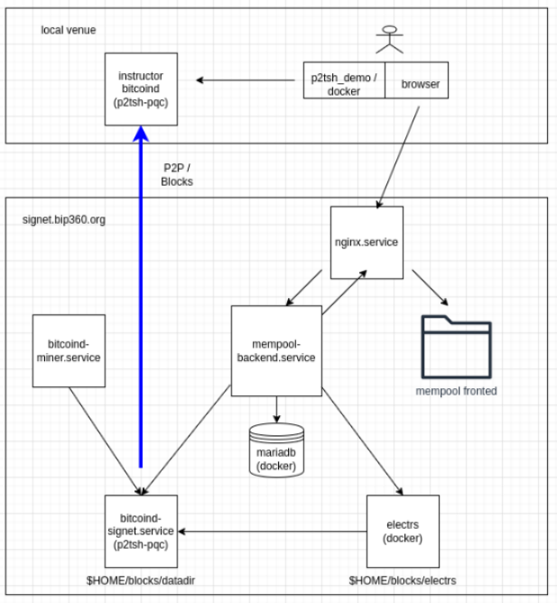
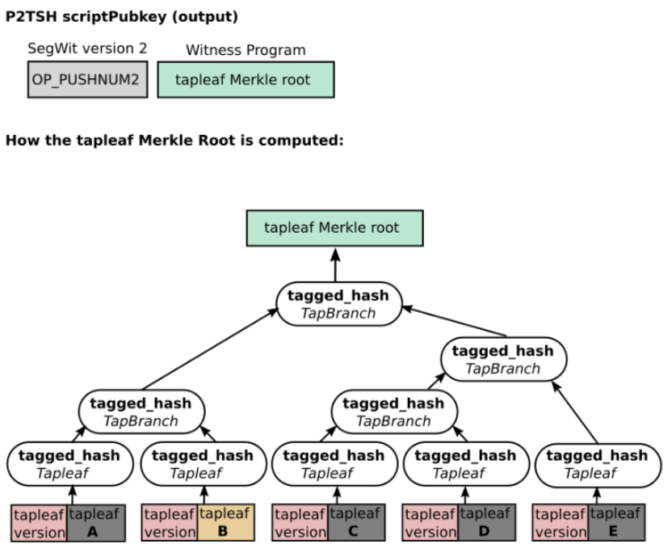
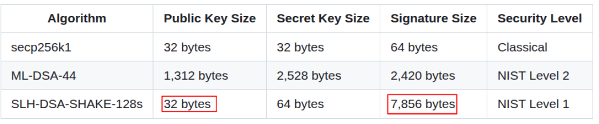
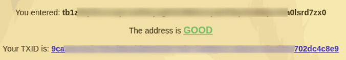
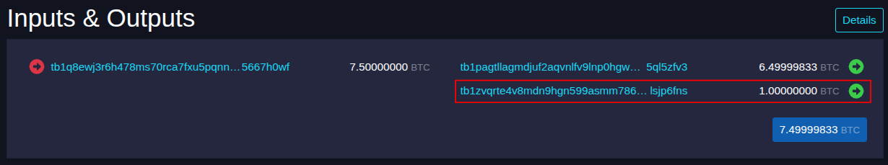
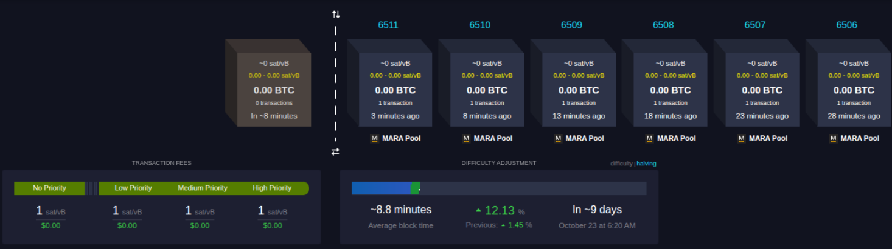
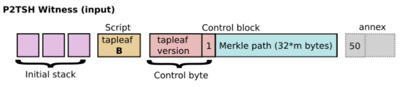
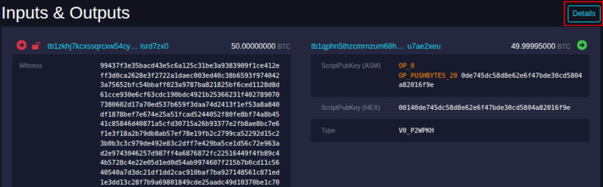
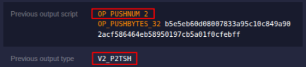

:scrollbar:
:data-uri:
:toc2:
:linkattrs:

= P2TSH End-to-End workshop

:numbered:

Welcome to the BIP-360 / _Pay-To-Tap-Script-Hash_ (P2TSH) workshop !

In this workshop, you will interact with a custom Signet environment to create, fund and spend from a _P2TSH_ address.

_P2TSH_ is a new Bitcoin address type defined in link:https://bip360.org/bip360.html[bip-360].

In addition, this workshop allows for the (un)locking mechanism of the leaf scripts of your P2TSH address to optionally use _Post Quantum Cryptography_ (PQC).
The use of PQC is alluded to in BIP-360 and will be further defined in future BIPs.

The steps outlined in this workshop are executed using a P2TSH/PQC enabled Bitcoin Core instance running on a signet environment.
*The target audience of the workshop is Bitcoin developers and ops personnel.
As such, the workshop makes heavy use of the _bitcoin-cli_ at the command line.*

== Pre-reqs

===  *docker / podman*

This workshop environment is provided as a _docker_ container.
Subsequently, ensure your host machine has either link:https://docs.docker.com/desktop/[docker] or link:https://podman.io/docs/installation[podman] installed.

=== *p2tsh_demo* docker container

==== Obtain container

Once docker or podman is installed on your machine, you can obtain the workshop docker container via any of the following:

. Pull from _quay.io_ :
+
[source,bash]
-----
sudo docker pull quay.io/jbride2000/p2tsh_demo:0.1
-----
+
NOTE:  The container image is 1.76GB in size.  This approach may be slow depending on network bandwidth.

. Download container image archive file from local HTTP server:
+
*TO_DO*

. Obtain container image archive file from instructor:

.. Workshop instructors have the container image available via USB thumb drives.
If you feel comfortable with this approach, ask an instructor for a thumb drive.

... Mount the USB thumb drive and copy for the file called:  _p2tsh_demo-image.tar_.
... Load the container image into your docker environment as per the following:
+
[source,bash]
-----
docker load -i /path/to/p2tsh_demo-image.tar
-----

==== Start container

You will need to start the workshop container using the docker infrastructure on your machine.

. If working at the command line, the following is an example to run the container and obtain a command prompt:
+
[source,bash]
-----

sudo docker run -it --rm --entrypoint /bin/bash --network host \
    -e RPC_CONNECT=10.21.3.194 \
    quay.io/jbride2000/p2tsh_demo:0.1
-----

. You should see a _bash_ shell command prompt similar to the following:
+
-----
bip360@0aa9edf3d201:~/bips/bip-0360/ref-impl/rust$ ls

Cargo.lock  Cargo.toml  README.md  docs  examples  src  tests
-----
+
As per the `ls` command seen above, your command prompt path defaults to the link:https://github.com/jbride/bips/tree/p2tsh/bip-0360/ref-impl/rust[Rust based reference implementation] for BIP-360.

==== Container contents
Your docker environment already includes a P2TSH/PQC enabled `bitcoin-cli` utility.
In addition, an alias to this custom bitcoin-cli utility configured for the signet workshop environment has also been provided.

. You can view this alias as follows (execute all commands within workshop container image):
+
[source,bash]
-----
declare -f b-cli
-----
+
You should see a response similar to the following:
+
-----
b-cli () 
{ 
    /usr/local/bin/bitcoin-cli -rpcconnect=${RPC_CONNECT:-192.168.122.1} -rpcport=${RPC_PORT:-18443} -rpcuser=${RPC_USER:-signet} -rpcpassword=${RPC_PASSWORD:-signet} "$@"
}
-----

. Test interaction between your _b-cli_ utility and the workshop's signet node via the following:
+
[source,bash]
-----
b-cli getnetworkinfo
-----
+
[source,bash]
-----
b-cli getblockcount
-----

. In addition, your docker environment also comes pre-installed with the following utilities needed for this workshop:

. *jq*: json parsing utility
. *awk* 
. *Rust* development environment with _cargo_ utility

== Bitcoin Environment

Your workshop instructors have provided you with a _P2TSH/PQC_ enabled Bitcoin environment running in _signet_.

You will send RPC commands to this custom Bitcoin node via the _b-cli_of your docker container.

Via your browser, you will interact with the P2TSH enabled _mempool.space_ for the workshop at: link:http://signet.bip360.org[signet.bip360.org].

== Create & Fund P2TSH Address

The purpose of this workshop is to demonstrate construction and spending of a link:https://github.com/cryptoquick/bips/blob/p2qrh/bip-0360.mediawiki[bip-360] _P2TSH_ address (optionally using _Post-Quantum Cryptography_).

In this section of the workshop, you create and fund a P2TSH address.

The following depicts the construction of a P2TSH _TapTree_ and computation its _scriptPubKey_.

A P2TSH address is created by adding locking scripts to leaves of a _TapTree_.
The locking scripts can use either _Schnorr_ (as per BIP-360) or _SLH-DSA_ (defined in a future BIP) cryptography.

. OPTIONAL: In your container image, indicate what type of cryptography to use in the locking scripts of your TapTree leaves.
Valid options are: `SLH_DSA_ONLY`, `SCHNORR_ONLY`, `SCHNORR_AND_SLH_DSA`.
Default is `SCHNORR_ONLY`.
+
[source,bash]
-----
$ export LEAF_SCRIPT_TYPE=SLH_DSA_ONLY
-----

.. If you set _LEAF_SCRIPT_TYPE=SCHNORR_ONLY_, then the locking script of your TapTree leaves will utilize _Schnorr_ cryptography.
+
Schnorr is not quantum-resistant.  However, its signature size is relatively small: 64 bytes.

.. If you set _LEAF_SCRIPT_TYPE=SLH_DSA_ONLY_, then the locking script of your TapTree leaves will utilize _SLH-DSA_ cryptography.
+
SLH_DSA is quantum-resistant.  However, the trade-off is the much larger signature size 7,856 bytes when spending.
+

+
NOTE: PQC cryptography is made available to this BIP-360 reference implementation via the link:https://crates.io/crates/bitcoinpqc[libbitcoinpqc Rust bindings].

.. If you set _LEAF_SCRIPT_TYPE=SCHNORR_AND_SLH_DSA_, then the locking script of your TapTree leaves will be secured using both SCHNORR and SLH-DSA cryptography.

. Define number of total leaves in tap tree :
+
[source,bash]
-----
export TOTAL_LEAF_COUNT=5
-----

. Set the tap leaf index to later use as the unlocking script (when spending)
+
[source,bash]
-----
export LEAF_OF_INTEREST=4
-----
+
NOTE: Defaults is 4 leaves with the first leaf (leaf 0 ) as the script to later use to unlock during spending. 

. Generate a P2TSH scripPubKey with multi-leaf taptree:
+
[source,bash]
-----
export BITCOIN_ADDRESS_INFO=$( cargo run --example p2tsh_construction ) \
    && echo $BITCOIN_ADDRESS_INFO | jq -r .
-----
+
NOTE:  In signet, you can expect a P2TSH address that starts with the following prefix: `tb1z` .
+
[subs=+quotes]
++++

<b>What just happened?</b>

The Rust based reference implementation for BIP-0360 is leveraged to construct a transaction with a P2TSH UTXO as follows:

<ul>
  <li>A configurable number of leaves are generated each with their own locking script.</li>
  <li>Each of these leaves are added to a Huffman tree that sorts the leaves by weight.</li>
  <li>The merkle root of the tree is calculated and subsequently used to generate the P2TSH witness program and BIP0350 address.</li>
</ul>

++++
+
The source code for the above logic is found in this project's source file:  link:../src/lib.rs[src/lib.rs]

. Fund this P2TSH address using workshop's signet faucet

.. In a browser tab, navigate to: link:http://faucet.bip360.org/[faucet.bip360.org].
.. Copy-n-paste the value of `bech32m_address` (found in the json response from the previous step)
+

+
Press the `Request` button.
.. The faucet should allocate bitcoin to your address.
+

.. Click on the link of your transaction id.
This will take you a detailed view of the transaction.
Scroll down to the the _Inputs & Outputs_ section of the transaction and identify the _vout_ index of funds sent to your _P2TSH_ address.
+

.. Return back to your terminal and set a _FUNDING_UTXO_INDEX_ environment variable (used later to correctly identify funding UTXO when generating the spending tx)
+
[source,bash]
-----
export FUNDING_UTXO_INDEX=<change me>
-----

.. Return back to your browser tab at navigate to: link:https://signet.bip360.org[signet.bip360.org] and wait until a new block mines the transaction from the faucet that funded your P2TSH address.
+

. Set some env vars (for use in later steps in this workshop) based on previous json result:
+
[source,bash]
-----
export MERKLE_ROOT=$( echo $BITCOIN_ADDRESS_INFO | jq -r '.taptree_return.tree_root_hex' ) \
    && export LEAF_SCRIPT_PRIV_KEYS_HEX=$( echo $BITCOIN_ADDRESS_INFO | jq -r '.taptree_return.leaf_script_priv_keys_hex' ) \
    && export LEAF_SCRIPT_HEX=$( echo $BITCOIN_ADDRESS_INFO | jq -r '.taptree_return.leaf_script_hex' ) \
    && export CONTROL_BLOCK_HEX=$( echo $BITCOIN_ADDRESS_INFO | jq -r '.taptree_return.control_block_hex' ) \
    && export FUNDING_SCRIPT_PUBKEY=$( echo $BITCOIN_ADDRESS_INFO | jq -r '.utxo_return.script_pubkey_hex' ) \
    && export P2TSH_ADDR=$( echo $BITCOIN_ADDRESS_INFO | jq -r '.utxo_return.bech32m_address' )
-----

. View tapscript used in target leaf of taptree:
+
[source,bash]
-----
b-cli decodescript $LEAF_SCRIPT_HEX | jq -r '.asm'
-----
+
NOTE:  If not using Schnorr crypto, this script commits to a Schnorr 32-byte x-only public key.
If using SLH_DSA, this script commits to a 32-byte SLH-DSA pub key and a OP_SUCCESS127 (represented as `OP_SUBSTR`) opcode.,
If using SCHNORR + SLH_DSA, then you should see a locking script in the leaf similar to the following:
+
-----
886fc1edb7a8a364da65aef57343de451c1449d8a6c5b766fe150667d50d3e80 OP_CHECKSIG 479f93fbd251863c3e3e72da6e26ea82f87313da13090de10e57eca1f8b5e0f3 OP_SUBSTR OP_BOOLAND OP_VERIFY
-----

. view summary of all txs that have funded P2TSH address
+
[source,bash]
-----
export P2TSH_DESC=$( b-cli getdescriptorinfo "addr($P2TSH_ADDR)" | jq -r '.descriptor' ) \
    && echo $P2TSH_DESC \
    && b-cli scantxoutset start '[{"desc": "'''$P2TSH_DESC'''"}]'
-----
+
NOTE:  You will likely have to wait a few minutes until a new block (containing the tx that funds your P2TSH address) is mined.

. grab txid of first tx with unspent funds:
+
[source,bash]
-----
export FUNDING_TX_ID=$( b-cli scantxoutset start '[{"desc": "'''$P2TSH_DESC'''"}]' | jq -r '.unspents[0].txid' ) \
    && echo $FUNDING_TX_ID
-----

. view details of funding UTXO to the P2TSH address:
+
[source,bash]
-----
export FUNDING_UTXO=$( b-cli getrawtransaction $FUNDING_TX_ID 1 | jq -r '.vout['''$FUNDING_UTXO_INDEX''']' ) \
    && echo $FUNDING_UTXO | jq -r .
-----

== Spend P2TSH UTXO

In the previous section, you created and funded a P2TSH UTXO.
That UTXO includes a leaf script locked with a key-pair (optionally based on PQC) known to you.

In this section, you spend from that P2TSH UTXO.
Specifically, you will generate an appropriate _SigHash_ and sign it (to create a signature) using the known private key that unlocks the known leaf script of the P2TSH UTXO.

The target address type that you send funds to is: P2WPKH.

. Determine value (in sats) of the funding P2TSH utxo:
+
[source,bash]
-----
export FUNDING_UTXO_AMOUNT_SATS=$(echo $FUNDING_UTXO | jq -r '.value' | awk '{printf "%.0f", $1 * 100000000}') \
    && echo $FUNDING_UTXO_AMOUNT_SATS
-----

. Referencing the funding tx (via $FUNDING_TX_ID and $FUNDING_UTXO_INDEX), create the spending tx:
+
[source,bash]
-----
export SPEND_DETAILS=$( cargo run --example p2tsh_spend )
-----
+
[subs=+quotes]
++++

<b>What just happened?</b>

The Rust based reference implementation for BIP-0360 is leveraged to construct a transaction that spends from the P2TSH UTXO as follows:

<ul>
  <li>Create a transaction template (aka: SigHash) that serves as the message to be signed.</li>
  <li>Using the known private key and the SigHash, create a signature that is capable of unlocking one of the leaf scripts of the P2TSH tree.</li>
  <li>Add this signature to the witness section of the transaction.</li>
</ul>

++++
+
The source code for the above logic is found in this project's source file:  link:../src/lib.rs[src/lib.rs]

. Set environment variables passed to _bitcoin-cli_ when spending:
+
[source,bash]
-----
export RAW_P2TSH_SPEND_TX=$( echo $SPEND_DETAILS | jq -r '.tx_hex' ) \
        && echo "RAW_P2TSH_SPEND_TX = $RAW_P2TSH_SPEND_TX" \
    && export SIG_HASH=$( echo $SPEND_DETAILS | jq -r '.sighash' ) \
        && echo "SIG_HASH = $SIG_HASH" \
    && export SIG_BYTES=$( echo $SPEND_DETAILS | jq -r '.sig_bytes' ) \
        && echo "SIG_BYTES = $SIG_BYTES"
-----

. Inspect the spending tx:
+
[source,bash]
-----
b-cli decoderawtransaction $RAW_P2TSH_SPEND_TX
-----
+
Pay particular attention to the `vin.txinwitness` field.
The following depicts the elements of a P2TSH witness stack.
+

+
Do the three elements (script input, script and control block) of the witness stack for this _script path spend_ correspond ?
What do you observe as the first byte of the `control block` element ?

. Test standardness of the spending tx by sending to local mempool of P2TSH enabled Bitcoin Core:
+
[source,bash]
-----
b-cli testmempoolaccept '["'''$RAW_P2TSH_SPEND_TX'''"]'
-----

. Submit tx:
+
[source,bash]
-----
export P2TSH_SPENDING_TX_ID=$( b-cli sendrawtransaction $RAW_P2TSH_SPEND_TX ) \
    && echo $P2TSH_SPENDING_TX_ID
-----
+
NOTE:  Should return same tx id as was included in $RAW_P2TSH_SPEND_TX

== Mine P2TSH Spend TX

. View tx in mempool:
+
[source,bash]
-----
b-cli getrawtransaction $P2TSH_SPENDING_TX_ID 1
-----
+
NOTE:  There will not yet be a field `blockhash` in the response.

. Monitor the mempool.space instance at link:http://signet.bip360.org[signet.bip360.org] until a new block is mined.

. While still in the mempool.space instance at link:http://signet.bip360.org[signet.bip360.org], lookup your tx (denoted by: $P2TSH_SPENDING_TX_ID ) in the top-right search bar:
+

+
Click on the `Details` button at the top-right of the `Inputs & Outputs` section.

.. Study the elements of the `Witness.  Approximately how large is each element of the witness stack?

.. View the values of the `Previous output script` and `Previous output type` fields:
+

. Obtain `blockhash` field of mined tx:
+
[source,bash]
-----
export BLOCK_HASH=$( b-cli getrawtransaction $P2TSH_SPENDING_TX_ID 1 | jq -r '.blockhash' ) \
    && echo $BLOCK_HASH
-----

. View txs in block:
+
[source,bash]
-----
b-cli getblock $BLOCK_HASH | jq -r .tx
-----
+
You should see your tx (as per $P2TSH_SPENDING_TX_ID)  in the list.
+
Congratulations!!  You have created, funded and spent from a P2TSH address.

== Appendix

[[build_p2tsh]]
=== Build P2TSH / PQC Enabled Bitcoin Core

*FOR THE PURPOSE OF THE WORKSHOP, YOU CAN IGNORE THIS SECTION*

The link:https://github.com/jbride/bitcoin/tree/p2tsh[p2tsh branch] of bitcoin core is needed.

Build instructions for the `p2tsh` branch are the same as `master` and is documented link:https://github.com/bitcoin/bitcoin/blob/master/doc/build-unix.md[here].

As such, the following is an example series of steps (on a Fedora 42 host) to compile and run the `p2tsh` branch of bitcoin core:

. Set BITCOIN_SOURCE_DIR
+
-----
$ export BITCOIN_SOURCE_DIR=/path/to/root/dir/of/cloned/bitcoin/source
-----

. build
+
-----
$ cmake -B build \
        -DWITH_ZMQ=ON \
        -DCMAKE_EXPORT_COMPILE_COMMANDS=ON \
        -DBUILD_BENCH=ON \
        -DBUILD_DAEMON=ON \
        -DSANITIZERS=address,undefined

$ cmake --build build -j$(nproc)
-----

. run in either `regtest` or `signet` mode:

.. regtest:
+
-----
$ ./build/bin/bitcoind -daemon=0 -regtest=1 -txindex -prune=0
-----

.. signet:
+
-----
$ ./build/bin/bitcoind -daemon=0 -signet=1 -txindex -prune=0
-----
+
NOTE: If running in `signet`, your bitcoin core will need to be configured with the `signetchallenge` property.
link:https://edil.com.br/blog/creating-a-custom-bitcoin-signet[This workshop] provides a nice overview of the topic.

=== libbitcoinpqc Rust bindings

*FOR THE PURPOSE OF THE WORKSHOP, YOU CAN IGNORE THIS SECTION*

The `p2tsh-pqc` branch of this project includes a dependency on the link:https://crates.io/crates/libbitcoinpqc[libbitcoinpqc crate].
libbitcoinpqc contains native code (C/C++/ASM) and is made available to Rust projects via Rust bindings.
This C/C++/ASM code is provided in the libbitcoinpqc crate as source code (not prebuilt binaries).

Subsequently, the `Cargo` utility needs to build this libbitcoinpqc C native code on your local machine.
You will need to have C development related libraries installed on your local machine.

Every developer or CI machine building `p2tsh-ref` must have cmake and a C toolchain installed locally.

==== Linux

. Debian / Ubuntu
+
-----
$ sudo apt update
$ sudo apt install cmake build-essential clang libclang-dev
-----

. Fedora / RHEL
+
-----
$ sudo dnf5 update
$ sudo dnf5 install cmake make gcc gcc-c++ clang clang-libs llvm-devel
-----
