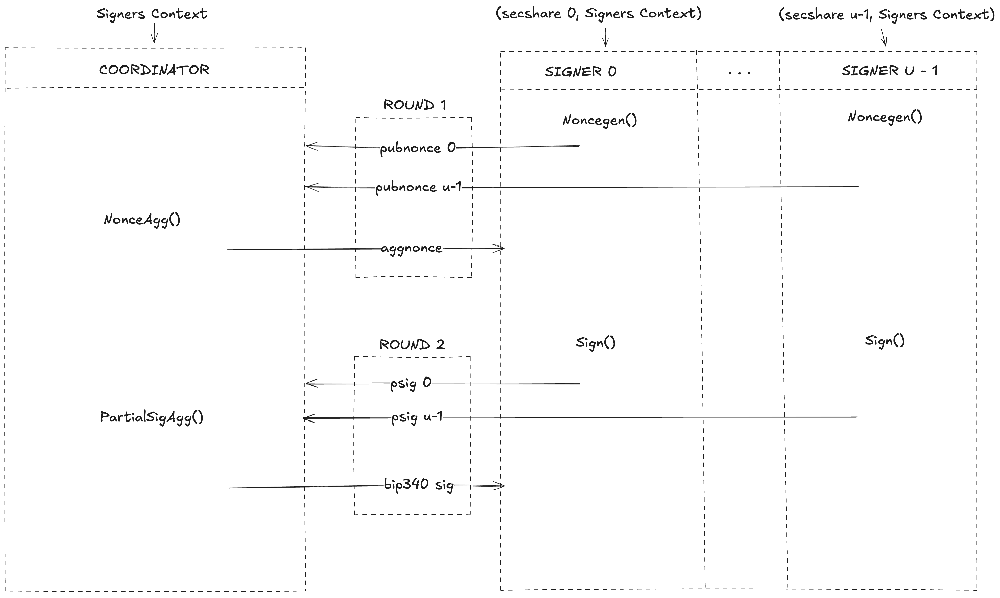

```
BIP: ?
Title: FROST Signing Protocol for BIP340 Signatures
Author: Sivaram Dhakshinamoorthy <siv2ram@gmail.com>
Comments-URI:
Status: Draft
Type: Standards Track
Assigned: ?
License: CC0-1.0
Discussion: 2024-07-31: https://groups.google.com/g/bitcoindev/c/PeMp2HQl-H4/m/AcJtK0aKAwAJ
Requires: 32, 340, 341
```

## Abstract

This document proposes a standard for the Flexible Round-Optimized Schnorr Threshold (FROST) signing protocol. The standard is compatible with [BIP340][bip340] public keys and signatures. It supports *tweaking*, which allows deriving [BIP32][bip32] child keys from the threshold public key and creating [BIP341][bip341] Taproot outputs with key and script paths.

## Copyright

This document is made available under [CC0 1.0 Universal](https://creativecommons.org/publicdomain/zero/1.0/).
The accompanying source code is licensed under the [MIT license](https://opensource.org/license/mit).

## Motivation

<!-- REVIEW: Should we add a paragraph about `OP_CHECKSIGADD` like BIP327 does? -->

The FROST signature scheme enables threshold Schnorr signatures. In a *t*-of-*n* threshold configuration, any *t*[^t-edge-cases] participants can cooperatively produce a Schnorr signature that is indistinguishable from a signature produced by a single signer. FROST signatures are unforgeable as long as fewer than *t* participants are corrupted. The signing protocol remains functional provided that at least *t* honest participants retain access to their secret key shares.

[^t-edge-cases]: While *t = n* and *t = 1* are in principle supported, simpler alternatives are available in these cases. In the case *t = n*, using a dedicated *n*-of-*n* multi-signature scheme such as MuSig2 (see [BIP327][bip327]) instead of FROST avoids the need for an interactive DKG. The case *t = 1* can be realized by letting one signer generate an ordinary [BIP340][bip340] key pair and transmitting the key pair to every other signer, who can check its consistency and then simply use the ordinary [BIP340][bip340] signing algorithm. Signers still need to ensure that they agree on a key pair.

The IRTF has published [RFC 9591][rfc9591], which specifies the FROST signing protocol for several elliptic curve and hash function combinations, including secp256k1 with SHA-256, the cryptographic primitives used in Bitcoin. However, the signatures produced by RFC 9591 are incompatible with BIP340 Schnorr signatures due to the X-only public keys introduced in BIP340. Additionally, RFC 9591 does not specify key tweaking mechanisms, which are essential for Bitcoin applications such as [BIP32][bip32] key derivation and [BIP341][bip341] Taproot. This document addresses these limitations by specifying a BIP340-compatible variant of FROST signing protocol that supports key tweaking.

Following the initial publication of the FROST protocol[[KG20][frost1]], several optimized variants have been proposed to improve computational efficiency and bandwidth optimization: FROST2[[CKM21][frost2]], FROST2-BTZ[[BTZ21][stronger-security-frost]], and FROST3[[RRJSS][roast], [CGRS23][olaf]]. Among these variants, FROST3 is the most efficient variant to date.

This document specifies the FROST3 variant[^frost3-security]. The FROST3 signing protocol shares substantial similarities with the MuSig2 signing protocol specified in [BIP327][bip327]. Accordingly, this specification adopts several design principles from BIP327, including support for key tweaking, partial signature verification, and identifiable abort mechanisms. We note that significant portions of this document have been directly adapted from BIP327 due to the similarities in the signing protocols. Key generation for FROST signing is out of scope for this document.

[^frost3-security]: The FROST3 signing scheme has been proven existentially unforgeable for both trusted dealer and distributed key generation setups. When using a trusted dealer for key generation, security reduces to the standard One-More Discrete Logarithm (OMDL) assumption. When instantiated with a distributed key generation protocol such as SimplPedPoP, security reduces to the Algebraic One-More Discrete Logarithm (AOMDL) assumption.

## Overview

Implementers must make sure to understand this section thoroughly to avoid subtle mistakes that may lead to catastrophic failure.

### Optionality of Features

The goal of this proposal is to support a wide range of possible application scenarios.
Given a specific application scenario, some features may be unnecessary or not desirable, and implementers can choose not to support them.
Such optional features include:

- Applying plain tweaks after x-only tweaks.
- Applying tweaks at all.
- Dealing with messages that are not exactly 32 bytes.
- Identifying a disruptive signer after aborting (aborting itself remains mandatory).
If applicable, the corresponding algorithms should simply fail when encountering inputs unsupported by a particular implementation. (For example, the signing algorithm may fail when given a message which is not 32 bytes.)
Similarly, the test vectors that exercise the unimplemented features should be re-interpreted to expect an error, or be skipped if appropriate.

### Key Material and Setup

<!-- REVIEW: should we use "identifiers `i`", secret share `secshare_i` style here? -->
A FROST key generation protocol configures a group of *n* participants with a *threshold public key* (representing a *t*-of-*n* threshold policy).
The corresponding *threshold secret key* is Shamir secret-shared among all *n* participants, where each participant holds a distinct long-term *secret share*.
This ensures that any subset of at least *t* participants can jointly run the FROST signing protocol to produce a signature under the *threshold secret key*.

Key generation for FROST signing is out of scope for this document. Implementations can use either a trusted dealer setup, as specified in [Appendix C of RFC 9591](https://www.rfc-editor.org/rfc/rfc9591.html#name-trusted-dealer-key-generati), or a distributed key generation (DKG) protocol such as [ChillDKG](https://github.com/BlockstreamResearch/bip-frost-dkg). The appropriate choice depends on the implementation's trust model and operational requirements.

This protocol distinguishes between two public key formats: *plain public keys* are 33-byte compressed public keys traditionally used in Bitcoin, while *X-only public keys* are 32-byte keys defined in [BIP340][bip340].
Key generation protocols produce *public shares* and *threshold public keys* in the plain format. During signing, we conditionally negate *secret shares* to ensure the resulting threshold-signature verifies under the corresponding *X-only threshold public key*.

> [!WARNING]
> Key generation protocols must commit the *threshold public key* to an unspendable script path as recommended in [BIP341](https://github.com/bitcoin/bips/blob/master/bip-0341.mediawiki#cite_note-23). This prevents a malicious party from embedding a hidden script path during key generation that would allow them to bypass the *t*-of-*n* threshold policy.

#### Protocol Parties and Network Setup

There are *u* (where *t <= u <= n < 2^32*) participants and one coordinator initiating the FROST signing protocol.
Each participant has a point-to-point communication link to the coordinator (but participants do not have direct communication links to each other).

If there is no dedicated coordinator, one of the participants can act as the coordinator.

#### Signing Inputs and Outputs

Each signing session requires two inputs: a participant's long-term *secret share* (individual to each participant, not shared with the coordinator) and a [Signers Context](#signers-context)[^signers-ctx-struct] data structure (common to all participants and the coordinator).

[^signers-ctx-struct]: The Signers Context represents the public data of signing participants: their identifiers (*id<sub>1..u</sub>*) and public shares (*pubshare<sub>1..u</sub>*).
Implementations may represent this as simply as two separate lists passed to signing APIs.
The threshold public key *thresh_pk* can be stored for efficiency or recomputed when needed using *DeriveThreshPubkey*.
Similarly, the values *n* and *t* are used only for validation, and can be omitted if validation is not performed.

This signing protocol is compatible with any key generation protocol that produces valid FROST keys.
Valid keys satisfy: (1) each *secret share* is a Shamir share of the *threshold secret key*, and (2) each *public share* equals the scalar multiplication *secshare \* G*.
Implementations may **optionally** validate key compatibility for a signing session using the *ValidateSignersCtx* function.
For comprehensive validation of the entire key material, *ValidateSignersCtx* can be run on all possible *u* signing participants.

> [!IMPORTANT]
> Passing *ValidateSignersCtx* ensures functional compatibility with the signing protocol but does not guarantee the security of the key generation protocol itself.

The output of the FROST signing protocol is a BIP340 Schnorr signature that verifies under the *threshold public key* as if it were produced by a single signer using the *threshold secret key*.

### General Signing Flow

The coordinator and signing participants must be determined before initiating the signing protocol.
The signing participants information is stored in a [Signers Context](#signers-context) data structure.
The *threshold public key* may optionally be tweaked by initializing a [Tweak Context](#tweak-context) at this stage.

Whenever the signing participants want to sign a message, the basic order of operations to create a threshold-signature is as follows:

**First broadcast round:**
Signers begin the signing session by running *NonceGen* to compute their *secnonce* and *pubnonce*.[^nonce-serialization-detail]
Each signer sends their *pubnonce* to the coordinator, who aggregates them using *NonceAgg* to produce an aggregate nonce and sends it back to all signers.

[^nonce-serialization-detail]: We treat the *secnonce* and *pubnonce* as grammatically singular even though they include serializations of two scalars and two elliptic curve points, respectively.
This treatment may be confusing for readers familiar with the MuSig2 paper.
However, serialization is a technical detail that is irrelevant for users of MuSig2 interfaces.

**Second broadcast round:**
At this point, every signer has the required data to sign, which, in the algorithms specified below, is stored in a data structure called [Session Context](#session-context).
Every signer computes a partial signature by running *Sign* with their long-term *secret share*, *secnonce* and the session context.
Then, the signers broadcast their partial signatures to the coordinator, who runs *PartialSigAgg* to produce the final signature.
If all parties behaved honestly, the result passes [BIP340][bip340] verification.



A malicious coordinator can cause the signing session to fail but cannot compromise the unforgeability of the scheme. Even when colluding with up to *t-1* signers, a malicious coordinator cannot forge a signature.

> [!TIP]
> The *Sign* algorithm must **not** be executed twice with the same *secnonce*.
> Otherwise, it is possible to extract the secret signing key from the two partial signatures output by the two executions of *Sign*.
> To avoid accidental reuse of *secnonce*, an implementation may securely erase the *secnonce* argument by overwriting it with 64 zero bytes after it has been read by *Sign*.
> A *secnonce* consisting of only zero bytes is invalid for *Sign* and will cause it to fail.

To simplify the specification of the algorithms, some intermediary values are unnecessarily recomputed from scratch, e.g., when executing *GetSessionValues* multiple times.
Actual implementations can cache these values.
As a result, the [Session Context](#session-context) may look very different in implementations or may not exist at all.
However, computation of *GetSessionValues* and storage of the result must be protected against modification from an untrusted third party.
This party would have complete control over the aggregate public key and message to be signed.

### Nonce Generation

*NonceGen* must have access to a high-quality random generator to draw an unbiased, uniformly random value *rand'*.
In contrast to BIP340 signing, the values *k<sub>1</sub>* and *k<sub>2</sub>* **must not be derived deterministically** from the session parameters because deriving nonces deterministically allows for a [complete key-recovery attack in multi-party discrete logarithm-based signatures](https://medium.com/blockstream/musig-dn-schnorr-multisignatures-with-verifiably-deterministic-nonces-27424b5df9d6#e3b6).
<!-- TODO: link a research paper, instead of a blog, for the multi-party discrete logarithm-based signatures. Maybe summarize the issue in a foot note? -->

The optional arguments to *NonceGen* enable a defense-in-depth mechanism that may prevent secret share exposure if *rand'* is accidentally not drawn uniformly at random.
If the value *rand'* was identical in two *NonceGen* invocations, but any other argument was different, the *secnonce* would still be guaranteed to be different as well (with overwhelming probability), and thus accidentally using the same *secnonce* for *Sign* in both sessions would be avoided.
Therefore, it is recommended to provide the optional arguments *secshare*, *pubshare*, *thresh_pk*, and *m* if these session parameters are already determined during nonce generation.
The auxiliary input *extra_in* can contain additional contextual data that has a chance of changing between *NonceGen* runs,
e.g., a supposedly unique session id (taken from the application), a session counter wide enough not to repeat in practice, any nonces by other signers (if already known), or the serialization of a data structure containing multiple of the above.
However, the protection provided by the optional arguments should only be viewed as a last resort.
In most conceivable scenarios, the assumption that the arguments are different between two executions of *NonceGen* is relatively strong, particularly when facing an active adversary.

In some applications, the coordinator may enable preprocessing of nonce generation to reduce signing latency.
Participants run *NonceGen* to generate a batch of *pubnonce* values before the message or Signers Context[^preprocess-round1] is known, which are stored with the coordinator (e.g., on a centralized server).
During this preprocessing phase, only the available arguments are provided to *NonceGen*.
When a signing session begins, the coordinator selects and aggregates *pubnonces* of the signing participants, enabling them to run *Sign* immediately once the message is determined.
This way, the final signature is created quicker and with fewer round trips.
However, applications that use this method presumably store the nonces for a longer time and must therefore be even more careful not to reuse them.
Moreover, this method is not compatible with the defense-in-depth mechanism described in the previous paragraph.
<!-- TODO: learn about security of FROST3 pre-process round. Write remarks about it, in security section -->

[^preprocess-round1]: When preprocessing *NonceGen* round, the Signers Context can be extended to include the *pubnonces* of the signing participants, as these are generated and stored before the signing session begins.

FROST signers are typically stateful: they generate *secnonce*, store it, and later use it to produce a partial signature after receiving the aggregated nonce.
However, stateless signing is possible when one signer receives the aggregate nonce of all OTHER signers before generating their own nonce.
In coordinator-based setups, the coordinator facilitates this by collecting pubnonces from the other signers, computing their aggregate (*aggothernonce*), and providing it to the stateless signer.
The stateless signer then runs *NonceGen*, *NonceAgg*, and *Sign* in sequence, sending its *pubnonce* and partial signature simultaneously to the coordinator, who computes the final aggregate nonce for all participants.
In coordinator-less setups, any one signer can achieve stateless operation by generating their nonce after seeing all other signers' *pubnonces*.
Stateless signers may want to consider signing deterministically (see [Modifications to Nonce Generation](#modifications-to-nonce-generation)) to remove the reliance on the random number generator in the *NonceGen* algorithm.

<!-- TODO: rewrite it for coordinator setup -->
### Identifying Disruptive Signers

The signing protocol makes it possible to identify malicious signers who send invalid contributions to a signing session in order to make the signing session abort and prevent the honest signers from obtaining a valid signature.
This property is called "identifiable aborts" and ensures that honest parties can assign blame to malicious signers who cause an abort in the signing protocol.

Aborts are identifiable for an honest party if the following conditions hold in a signing session:

- The contributions received from all signers have not been tampered with (e.g., because they were sent over authenticated connections).
- Nonce aggregation is performed honestly (e.g., because the honest signer performs nonce aggregation on its own or because the coordinator is trusted).
- The partial signatures received from all signers are verified using the algorithm *PartialSigVerify*.

If these conditions hold and an honest party (signer or coordinator) runs an algorithm that fails due to invalid protocol contributions from malicious signers, then the algorithm run by the honest party will output the participant identifier of exactly one malicious signer.
Additionally, if the honest parties agree on the contributions sent by all signers in the signing session, all the honest parties who run the aborting algorithm will identify the same malicious signer.

#### Further Remarks

Some of the algorithms specified below may also assign blame to a malicious coordinator.
While this is possible for some particular misbehavior of the coordinator, it is not guaranteed that a malicious coordinator can be identified.
More specifically, a malicious coordinator (whose existence violates the second condition above) can always make signing abort and wrongly hold honest signers accountable for the abort (e.g., by claiming to have received an invalid contribution from a particular honest signer).

The only purpose of the algorithm *PartialSigVerify* is to ensure identifiable aborts, and it is not necessary to use it when identifiable aborts are not desired.
In particular, partial signatures are *not* signatures.
An adversary can forge a partial signature, i.e., create a partial signature without knowing the secret share for that particular participant public share.[^partialsig-forgery]
However, if *PartialSigVerify* succeeds for all partial signatures then *PartialSigAgg* will return a valid Schnorr signature.

[^partialsig-forgery]: Assume a malicious participant intends to forge a partial signature for the participant with public share *P*. It participates in the signing session pretending to be two distinct signers: one with the public share *P* and the other with its own public share. The adversary then sets the nonce for the second signer in such a way that allows it to generate a partial signature for *P*. As a side effect, it cannot generate a valid partial signature for its own public share. An explanation of the steps required to create a partial signature forgery can be found in [this document](https://gist.github.com/siv2r/0eab97bae9b7186ef2a4919e49d3b426).

### Tweaking the Threshold Public Key

The threshold public key can be *tweaked*, which modifies the key as defined in the [Tweaking Definition](#tweaking-definition) subsection.
In order to apply a tweak, the Tweak Context output by *TweakCtxInit* is provided to the *ApplyTweak* algorithm with the *is_xonly_t* argument set to false for plain tweaking and true for X-only tweaking.
The resulting Tweak Context can be used to apply another tweak with *ApplyTweak* or obtain the threshold public key with *GetXonlyPubkey* or *GetPlainPubkey*.

The purpose of supporting tweaking is to ensure compatibility with existing uses of tweaking, i.e., that the result of signing is a valid signature for the tweaked public key.
The FROST signing algorithms take arbitrary tweaks as input but accepting arbitrary tweaks may negatively affect the security of the scheme.[^arbitrary-tweaks]
Instead, signers should obtain the tweaks according to other specifications.
This typically involves deriving the tweaks from a hash of the threshold public key and some other information.
Depending on the specific scheme that is used for tweaking, either the plain or the X-only threshold public key is required.
For example, to do [BIP32][bip32] derivation, you call *GetPlainPubkey* to be able to compute the tweak, whereas [BIP341][bip341] TapTweaks require X-only public keys that are obtained with *GetXonlyPubkey*.

[^arbitrary-tweaks]: It is an open question whether allowing arbitrary tweaks from an adversary affects the unforgeability of FROST.

The tweak mode provided to *ApplyTweak* depends on the application:
Plain tweaking can be used to derive child public keys from a threshold public key using [BIP32][bip32].
On the other hand, X-only tweaking is required for Taproot tweaking per [BIP341][bip341].
A Taproot-tweaked public key commits to a *script path*, allowing users to create transaction outputs that are spendable either with a FROST threshold-signature or by providing inputs that satisfy the script path.
Script path spends require a control block that contains a parity bit for the tweaked X-only public key.
<!-- markdownlint-disable-next-line MD011 -->
The bit can be obtained with *GetPlainPubkey(tweak_ctx)[0] & 1*.

## Algorithms

The following specification of the algorithms has been written with a focus on clarity. As a result, the specified algorithms are not always optimal in terms of computation and space. In particular, some values are recomputed but can be cached in actual implementations (see [General Signing Flow](#general-signing-flow)).

### Notation

The algorithms are defined over the **[secp256k1](https://www.secg.org/sec2-v2.pdf) group and its associated scalar field**. We note that adapting this proposal to other elliptic curves is not straightforward and can result in an insecure scheme.

#### Cryptographic Types and Operations

We rely on the following types and conventions throughout this document:

- **Types:** Points on the curve are represented by the object *GE*, and scalars are represented by *Scalar*.
- **Naming:** Points are denoted using uppercase letters (e.g., *P*, *Q*), while scalars are denoted using lowercase letters (e.g., *r*, *s*).
- **Mathematical Context:** Points are group elements under elliptic curve addition. The group includes all points on the secp256k1 curve plus the point at infinity (the identity element).
- **Arithmetic:** The operators +, -, and &middot; are overloaded depending on their operands:
  - **Scalar Arithmetic:** When applied to two *Scalar* operands, +, -, and &middot; denote integer addition, subtraction, and multiplication modulo the group order.
  - **Point Addition:** When applied to two *GE* operands, + denotes the elliptic curve [group addition operation](https://en.wikipedia.org/wiki/Elliptic_curve#The_group_law).
  - **Scalar Multiplication:** The notation r &middot; P denotes [scalar multiplication](https://en.wikipedia.org/wiki/Elliptic_curve_point_multiplication) (the repeated addition of point P, r times).

The reference code vendors the secp256k1lab library to handle underlying arithmetic, serialization, deserialization, and auxiliary functions. To improve the readability of this specification, we utilize simplified notation aliases for the library's internal methods, as mapped below:

<!-- markdownlint-disable MD033 -->
| Notation | secp256k1lab | Description |
| --- | --- | --- |
| *p* | *FE.SIZE* | Field element size |
| *ord* | *GE.ORDER* | Group order |
| *G* | *G* | The secp256k1 generator point |
| *inf_point* | *GE()* | The infinity point |
| *is_infinity(P)* | *P.infinity()* | Returns whether *P* is the point at infinity |
| *x(P)* | *P.x* | Returns the x-coordinate of a non-infinity point *P*, in the range *[0, p−1]* |
| *y(P)* | *P.y* | Returns the y-coordinate of a non-infinity point *P*, in the range *[0, p-1]* |
| *has_even_y(P)* | *P.has_even_y()* | Returns whether *P* has an even y-coordinate |
| *with_even_y(P)* | - | Returns the version of point *P* that has an even y-coordinate. If *P* already has an even y-coordinate (or is infinity), it is returned unchanged. Otherwise, its negation *-P* is returned |
| *xbytes(P)* | *P.to_bytes_xonly()* | Returns the 32-byte x-only serialization of a non-infinity point *P* |
| *cbytes(P)* | *P.to_bytes_compressed()* | Returns the 33-byte compressed serialization of a non-infinity point *P* |
| *cbytes_ext(P)* | *P.to_bytes_compressed<br>_with_infinity()* | Returns the 33-byte compressed serialization of a point *P*. If *P* is the point at infinity, it is encoded as a 33-byte array of zeros. |
| *lift_x(x)*[^liftx-soln] | *GE.lift_x(x)* | Decodes a 32-byte x-only serialization *x* into a non-infinity point P. The resulting point always has an even y-coordinate. |
| *cpoint(b)* | *GE.from_bytes_compressed(b)* | Decodes a 33-byte compressed serialization *b* into a non-infinity point |
| *cpoint_ext(b)* | *GE.from_bytes_compressed<br>_with_infinity(b)* | Decodes a 33-byte compressed serialization *b* into a point. If *b* is a 33-byte array of zeros, it returns the point at infinity |
| *scalar_to_bytes(s)* | *s.to_bytes()* | Returns the 32-byte serialization of a scalar *s* |
| *scalar_from_bytes_checked(b)* | *Scalar.from_bytes_checked(b)* | Deserializes a 32-byte array *b* to a scalar, fails if the value is ≥ *ord* |
| *scalar_from_bytes<br>_nonzero_checked(b)* | *Scalar.from_bytes<br>_nonzero_checked(b)* | Deserializes a 32-byte array *b* to a scalar, fails if the value is zero or ≥ *ord* |
| *scalar_from_bytes_wrapping(b)* | *Scalar.from_bytes_wrapping(b)* | Deserializes a 32-byte array *b* to a scalar, reducing the value modulo *ord* |
| *hash<sub>tag</sub>(x)* | *tagged_hash(x)* | Computes a 32-byte domain-separated hash of the byte array *x*. The output is *SHA256(SHA256(tag) \|\| SHA256(tag) \|\| x)*, where *tag* is UTF-8 encoded string unique to the context |
| *random_bytes(n)* | - | Returns *n* bytes, sampled uniformly at random using a cryptographically secure pseudorandom number generator (CSPRNG) |
| *xor_bytes(a, b)* | *xor_bytes(a, b)* | Returns byte-wise xor of *a* and *b* |
<!-- markdownlint-enable MD033 -->

[^liftx-soln]: Given a candidate X coordinate *x* in the range *0..p-1*, there exist either exactly two or exactly zero valid Y coordinates. If no valid Y coordinate exists, then *x* is not a valid X coordinate either, i.e., no point *P* exists for which *x(P) = x*. The valid Y coordinates for a given candidate *x* are the square roots of *c = x<sup>3</sup> + 7 mod p* and they can be computed as *y = ±c<sup>(p+1)/4</sup> mod p* (see [Quadratic residue](https://en.wikipedia.org/wiki/Quadratic_residue#Prime_or_prime_power_modulus)) if they exist, which can be checked by squaring and comparing with *c*.

#### Auxiliary and Byte-string Operations

The following helper functions and notation are used for operations on standard integers and byte arrays, independent of curve arithmetic. Note that like Scalars, these variables are denoted by lowercase letters (e.g., *x*, *n*); the intended type is implied by context.

| Notation | Description |
| --- | --- |
| *\|\|* | Refers to byte array concatenation |
| *len(x)* | Returns the length of the byte array *x* in bytes |
| *x[i:j]* | Returns the sub-array of the byte array *x* starting at index *i* (inclusive) and ending at *j* (exclusive). The result has length *j - i* |
| *empty_bytestring* | A constant representing an empty byte array where length is 0 |
| *bytes(n, x)* | Returns the big-endian *n*-byte encoding of the integer *x* |
| *count(x, lst)* | Returns the number of times the element *x* occurs in the list *lst* |
| *has_duplicates(lst)* | Returns *True* if any element in *lst* appears more than once, *False* otherwise |
| *sorted(lst)* | Returns a new list containing the elements of *lst* arranged in ascending order |
| *(a, b, ...)* | Refers to a tuple containing the listed elements |

> [!NOTE]
> In the following algorithms, all scalar arithmetic is understood to be modulo the group order. For example, *a &middot; b* implicitly means *a &middot; b mod order*

### Key Material and Setup

#### Signers Context

The Signers Context is a data structure consisting of the following elements:

- The total number *n* of participants involved in key generation: an integer with *2 ≤ n < 2<sup>32</sup>*
- The threshold number *t* of participants required to issue a signature: an integer with *1 ≤ t ≤ n*
- The number *u* of signing participants: an integer with *t ≤ u ≤ n*
- The list of participant identifiers *id<sub>1..u</sub>*: *u* distinct integers, each with *0 ≤ id<sub>i</sub> ≤ n - 1*
- The list of participant public shares *pubshare<sub>1..u</sub>*: *u* 33-byte arrays, each a compressed serialized point
- The threshold public key *thresh_pk*: a 33-byte array, compressed serialized point

We write "Let *(n, t, u, id<sub>1..u</sub>, pubshare<sub>1..u</sub>, thresh_pk) = signers_ctx*" to assign names to the elements of Signers Context.

Algorithm *ValidateSignersCtx(signers_ctx)*:

- Inputs:
  - The *signers_ctx*: a [Signers Context](#signers-context) data structure
- *(n, t, u, id<sub>1..u</sub>, pubshare<sub>1..u</sub>, thresh_pk) = signers_ctx*
- Fail if not *1 ≤ t ≤ n*
- Fail if not *t ≤ u ≤ n*
- For *i = 1 .. u*:
  - Fail if not *0 ≤ id<sub>i</sub> ≤ n - 1*
  - Fail if *cpoint(pubshare<sub>i</sub>)* fails
- Fail if *has_duplicates(id<sub>1..u</sub>)*
- Fail if *DeriveThreshPubkey(id<sub>1..u</sub>, pubshare<sub>1..u</sub>) ≠ thresh_pk*
- No return

Internal Algorithm *DeriveThreshPubkey(id<sub>1..u</sub>,  pubshare<sub>1..u</sub>)*[^derive-thresh-no-validate-inputs]

- *Q = inf_point*
- For *i = 1..u*:
  - *P* = cpoint(pubshare<sub>i</sub>); fail if that fails
  - *&lambda; = DeriveInterpolatingValue(id<sub>1..u</sub>, id<sub>i</sub>)*
  - *Q = Q + &lambda; &middot; P*
- Return *cbytes(Q)*

[^derive-thresh-no-validate-inputs]: *DeriveThreshPubkey* does not check that its inputs are in range. This validation is performed by *ValidateSignersCtx*, which is its only caller.

Internal Algorithm *DeriveInterpolatingValue(id<sub>1..u</sub>, my_id):*

- Fail if *my_id* not in *id<sub>1..u</sub>*
- Fail if *has_duplicates(id<sub>1..u</sub>)*
- Let *num = Scalar(1)*
- Let *deno = Scalar(1)*
- For *i = 1..u*:
  - If *id<sub>i</sub> ≠ my_id*:
    - Let *num = num &middot; Scalar(id<sub>i</sub> + 1)[^lagrange-shift] &ensp;(mod ord)*
    - Let *deno = deno &middot; Scalar(id<sub>i</sub> - my_id) &ensp;(mod ord)*
- *&lambda; = num &middot; deno<sup>-1</sup> &ensp;(mod ord)*
- Return *&lambda;*

[^lagrange-shift]: The standard Lagrange interpolation coefficient uses the formula *id<sub>i</sub> / (id<sub>i</sub> - my_id)* for each term in the product, where ids are in the range *1..n*. However, since participant identifiers in this protocol are zero-indexed (range *0..n-1*), we shift them by adding 1. This transforms each term to *(id<sub>i</sub>+1) / (id<sub>i</sub> - my_id)*.

### Tweaking the Threshold Public Key

#### Tweak Context

The Tweak Context is a data structure consisting of the following elements:

- The point *Q* representing the potentially tweaked threshold public key: a *GE*
- The accumulated tweak *tacc*: a *Scalar*
- The value *gacc*: *Scalar(1)* or *Scalar(-1)*

We write "Let *(Q, gacc, tacc) = tweak_ctx*" to assign names to the elements of a Tweak Context.

Algorithm *TweakCtxInit(thresh_pk):*

- Input:
  - The threshold public key *thresh_pk*: a 33-byte array, compressed serialized point
- Let *Q = cpoint(thresh_pk)*; fail if that fails
- Fail if *is_infinity(Q)*
- Let *gacc = Scalar(1)*
- Let *tacc = Scalar(0)*
- Return *tweak_ctx = (Q, gacc, tacc)*

Algorithm *GetXonlyPubkey(tweak_ctx)*:

- Inputs:
  - The *tweak_ctx*: a [Tweak Context](#tweak-context) data structure
- Let *(Q, _, _) = tweak_ctx*
- Return *xbytes(Q)*

Algorithm *GetPlainPubkey(tweak_ctx)*:

- Inputs:
  - The *tweak_ctx*: a [Tweak Context](#tweak-context) data structure
- Let *(Q, _, _) = tweak_ctx*
- Return *cbytes(Q)*

#### Applying Tweaks

Algorithm *ApplyTweak(tweak_ctx, tweak, is_xonly_t)*:

- Inputs:
  - The *tweak_ctx*: a [Tweak Context](#tweak-context) data structure
  - The *tweak*: a 32-byte array, serialized scalar
  - The tweak mode *is_xonly_t*: a boolean
- Let *(Q, gacc, tacc) = tweak_ctx*
- If *is_xonly_t* and not *has_even_y(Q)*:
  - Let *g = Scalar(-1)*
- Else:
  - Let *g = Scalar(1)*
- Let *t = scalar_from_bytes_nonzero_checked(tweak)*; fail if that fails
- Let *Q' = g &middot; Q + t &middot; G*
  - Fail if *is_infinity(Q')*
- Let *gacc' = g &middot; gacc &ensp;(mod ord)*
- Let *tacc' = t + g &middot; tacc &ensp;(mod ord)*
- Return *tweak_ctx' = (Q', gacc', tacc')*

### Nonce Generation

Algorithm *NonceGen(secshare, pubshare, thresh_pk, m, extra_in)*:

- Inputs:
  - The participant secret signing share *secshare*: a 32-byte array, serialized scalar (optional argument)
  - The participant public share *pubshare*: a 33-byte array, compressed serialized point (optional argument)
  <!-- REVIEW: why is this xonly? why not include the 33-bytes serialization? -->
  - The x-only threshold public key *thresh_pk*: a 32-byte array, X-only serialized point (optional argument)
  - The message *m*: a byte array (optional argument)[^max-msg-len]
  - The auxiliary input *extra_in*: a byte array with *0 ≤ len(extra_in) ≤ 2<sup>32</sup>-1* (optional argument)
- Let *rand' = random_bytes(32)*
- If the optional argument *secshare* is present:
  - Let *rand = xor_bytes(secshare, hash<sub>FROST/aux</sub>(rand'))*[^sk-xor-rand]
- Else:
  - Let *rand = rand'*
- If the optional argument *pubshare* is not present:
  - Let *pubshare* = *empty_bytestring*
- If the optional argument *thresh_pk* is not present:
  - Let *thresh_pk* = *empty_bytestring*
- If the optional argument *m* is not present:
  - Let *m_prefixed = bytes(1, 0)*
- Else:
  - Let *m_prefixed = bytes(1, 1) || bytes(8, len(m)) || m*
- If the optional argument *extra_in* is not present:
  - Let *extra_in = empty_bytestring*
- Let *k<sub>i</sub> = scalar_from_bytes_wrapping(hash<sub>FROST/nonce</sub>(rand || bytes(1, len(pubshare)) || pubshare || bytes(1, len(thresh_pk)) || thresh_pk || m_prefixed || bytes(4, len(extra_in)) || extra_in || bytes(1, i - 1)))* for *i = 1,2*
- Fail if *k<sub>1</sub> = Scalar(0)* or *k<sub>2</sub> = Scalar(0)*
- Let *R<sub>\*,1</sub> = k<sub>1</sub> &middot; G*, *R<sub>\*,2</sub> = k<sub>2</sub> &middot; G*
- Let *pubnonce = cbytes(R<sub>\*,1</sub>) || cbytes(R<sub>\*,2</sub>)*
- Let *secnonce = bytes(32, k<sub>1</sub>) || bytes(32, k<sub>2</sub>)*[^secnonce-ser]
- Return *(secnonce, pubnonce)*

[^sk-xor-rand]: The random data is hashed (with a unique tag) as a precaution against situations where the randomness may be correlated with the secret signing share itself. It is xored with the secret share (rather than combined with it in a hash) to reduce the number of operations exposed to the actual secret share.

[^secnonce-ser]: The algorithms as specified here assume that the *secnonce* is stored as a 64-byte array using the serialization *secnonce = bytes(32, k<sub>1</sub>) || bytes(32, k<sub>2</sub>)*. The same format is used in the reference implementation and in the test vectors. However, since the *secnonce* is (obviously) not meant to be sent over the wire, compatibility between implementations is not a concern, and this method of storing the *secnonce* is merely a suggestion. The *secnonce* is effectively a local data structure of the signer which comprises the value pair *(k<sub>1</sub>, k<sub>2</sub>)*, and implementations may choose any suitable method to carry it from *NonceGen* (first communication round) to *Sign* (second communication round). In particular, implementations may choose to hide the *secnonce* in internal state without exposing it in an API explicitly, e.g., in an effort to prevent callers from reusing a *secnonce* accidentally.

[^max-msg-len]: In theory, the allowed message size is restricted because SHA256 accepts byte strings only up to size of 2^61-1 bytes (and because of the 8-byte length encoding).

### Nonce Aggregation

Algorithm *NonceAgg(pubnonce<sub>1..u</sub>, id<sub>1..u</sub>)*:

- Inputs:
  - The number *u* of signing participants: an integer with *t ≤ u ≤ n*
  - The list of participant public nonces *pubnonce<sub>1..u</sub>*: *u* 66-byte array, each an output of *NonceGen*
  - The list of participant identifiers *id<sub>1..u</sub>*: *u* integers, each with 0 ≤ *id<sub>i</sub>* < *n*
- For *j = 1 .. 2*:
  - For *i = 1 .. u*:
    - Let *R<sub>i,j</sub> = cpoint(pubnonce<sub>i</sub>[(j-1)\*33:j\*33])*; fail if that fails and blame signer *id<sub>i</sub>* for invalid *pubnonce*
  - Let *R<sub>j</sub> = R<sub>1,j</sub> + R<sub>2,j</sub> + ... + R<sub>u,j</sub>*
- Return *aggnonce = cbytes_ext(R<sub>1</sub>) || cbytes_ext(R<sub>2</sub>)*

### Session Context

The Session Context is a data structure consisting of the following elements:

- The *signers_ctx*: a [Signers Context](#signers-context) data structure
- The aggregate public nonce *aggnonce*: a 66-byte array, output of *NonceAgg*
- The number *v* of tweaks with *0 ≤ v < 2^32*
- The list of tweaks *tweak<sub>1..v</sub>*: *v* 32-byte arrays, each a serialized scalar
- The list of tweak modes *is_xonly_t<sub>1..v</sub>* : *v* booleans
- The message *m*: a byte array[^max-msg-len]

We write "Let *(signers_ctx, aggnonce, v, tweak<sub>1..v</sub>, is_xonly_t<sub>1..v</sub>, m) = session_ctx*" to assign names to the elements of a Session Context.

Algorithm *GetSessionValues(session_ctx)*:

- Let *(signers_ctx, aggnonce, v, tweak<sub>1..v</sub>, is_xonly_t<sub>1..v</sub>, m) = session_ctx*
- *ValidateSignersCtx(signers_ctx)*; fail if that fails
- Let *(_, _, u, id<sub>1..u</sub>, pubshare<sub>1..u</sub>, thresh_pk) = signers_ctx*
- Let *tweak_ctx<sub>0</sub> = TweakCtxInit(thresh_pk)*; fail if that fails
- For *i = 1 .. v*:
  - Let *tweak_ctx<sub>i</sub> = ApplyTweak(tweak_ctx<sub>i-1</sub>, tweak<sub>i</sub>, is_xonly_t<sub>i</sub>)*; fail if that fails
- Let *(Q, gacc, tacc) = tweak_ctx<sub>v</sub>*
- Let *ser_ids* = *SerializeIds(id<sub>1..u</sub>)*
- Let *b* = *scalar_from_bytes_wrapping(hash<sub>FROST/noncecoef</sub>(ser_ids || aggnonce || xbytes(Q) || m))*
- Fail if *b = Scalar(0)*
- Let *R<sub>1</sub> = cpoint_ext(aggnonce[0:33]), R<sub>2</sub> = cpoint_ext(aggnonce[33:66])*; fail if that fails and blame the coordinator for invalid *aggnonce*.
- Let *R' = R<sub>1</sub> + b &middot; R<sub>2</sub>*
- If *is_infinity(R'):*
  - Let final nonce *R = G* ([see Dealing with Infinity in Nonce Aggregation](#dealing-with-infinity-in-nonce-aggregation))
- Else:
  - Let final nonce *R = R'*
- Let *e = scalar_from_bytes_wrapping(hash<sub>BIP0340/challenge</sub>((xbytes(R) || xbytes(Q) || m)))*
- Fail if *e = Scalar(0)*
- Return (Q, gacc, tacc, id<sub>1..u</sub>, pubshare<sub>1..u</sub>, b, R, e)

Internal Algorithm *SerializeIds(id<sub>1..u</sub>)*:

- *res = empty_bytestring*
- For *id* in *sorted(id<sub>1..u</sub>)*:
  - *res = res || bytes(4, id)*
- Return *res*

### Signing

Algorithm *Sign(secnonce, secshare, my_id, session_ctx)*:

- Inputs:
  - The secret nonce *secnonce* that has never been used as input to *Sign* before: a 64-byte array[^secnonce-ser]
  - The participant secret signing share *secshare*: a 32-byte array, serialized scalar
  - The participant identifier *my_id*: an integer with *0 ≤ my_id ≤ n-1*
  - The *session_ctx*: a [Session Context](#session-context) data structure
- Let *(Q, gacc, _, id<sub>1..u</sub>, pubshare<sub>1..u</sub>, b, R, e) = GetSessionValues(session_ctx)*; fail if that fails
- Let *k<sub>1</sub>' = scalar_from_bytes_nonzero_checked(secnonce[0:32])*; fail if that fails
- Let *k<sub>2</sub>' = scalar_from_bytes_nonzero_checked(secnonce[32:64])*; fail if that fails
- Let *k<sub>1</sub> = k<sub>1</sub>', k<sub>2</sub> = k<sub>2</sub>'* if *has_even_y(R)*, otherwise let *k<sub>1</sub> = -k<sub>1</sub>', k<sub>2</sub> = -k<sub>2</sub>'*
- Let *d' = scalar_from_bytes_nonzero_checked(secshare)*; fail if that fails
- Let *pubshare = cbytes(d' &middot; G)*
- Fail if *pubshare* not in *pubshare<sub>1..u</sub>*
- Fail if *my_id* not in *id<sub>1..u</sub>*
- Let *&lambda; = DeriveInterpolatingValue(id<sub>1..u</sub>, my_id)*; fail if that fails
- Let *g = Scalar(1)* if *has_even_y(Q)*, otherwise let *g = Scalar(-1)*
- Let *d = g &middot; gacc &middot; d' &ensp;(mod ord)* (See [Negation of Secret Share When Signing](#negation-of-the-secret-share-when-signing))
- Let *s = k<sub>1</sub> + b &middot; k<sub>2</sub> + e &middot; &lambda; &middot; d &ensp;(mod ord)*
- Let *psig = scalar_to_bytes(s)*
- Let *pubnonce = cbytes(k<sub>1</sub>' &middot; G) || cbytes(k<sub>2</sub>' &middot; G)*
- If *PartialSigVerifyInternal(psig, my_id, pubnonce, pubshare, session_ctx)* (see below) returns failure, fail[^why-verify-partialsig]
- Return partial signature *psig*

[^why-verify-partialsig]: Verifying the signature before leaving the signer prevents random or adversarially provoked computation errors. This prevents publishing invalid signatures which may leak information about the secret share. It is recommended but can be omitted if the computation cost is prohibitive.

### Partial Signature Verification

Algorithm *PartialSigVerify(psig, pubnonce<sub>1..u</sub>, signers_ctx, tweak<sub>1..v</sub>, is_xonly_t<sub>1..v</sub>, m, i)*:

- Inputs:
  - The partial signature *psig*: a 32-byte array, serialized scalar
  - The list public nonces *pubnonce<sub>1..u</sub>*: *u* 66-byte arrays, each an output of *NonceGen*
  - The *signers_ctx*: a [Signers Context](#signers-context) data structure
  - The number *v* of tweaks with *0 ≤ v < 2^32*
  - The list of tweaks *tweak<sub>1..v</sub>*: *v* 32-byte arrays, each a serialized scalar
  - The list of tweak modes *is_xonly_t<sub>1..v</sub>* : *v* booleans
  - The message *m*: a byte array[^max-msg-len]
  - The index *i* of the signer in the list of public nonces where *0 < i ≤ u*
- Let *(_, _, u, id<sub>1..u</sub>, pubshare<sub>1..u</sub>, _) = signers_ctx*
- Let *aggnonce = NonceAgg(pubnonce<sub>1..u</sub>, id<sub>1..u</sub>)*; fail if that fails
- Let *session_ctx = (signers_ctx, aggnonce, v, tweak<sub>1..v</sub>, is_xonly_t<sub>1..v</sub>, m)*
- Run *PartialSigVerifyInternal(psig, id<sub>i</sub>, pubnonce<sub>i</sub>, pubshare<sub>i</sub>, session_ctx)*
- Return success iff no failure occurred before reaching this point.

Internal Algorithm *PartialSigVerifyInternal(psig, my_id, pubnonce, pubshare, session_ctx)*:

- Let *(Q, gacc, _, id<sub>1..u</sub>, pubshare<sub>1..u</sub>, b, R, e) = GetSessionValues(session_ctx)*; fail if that fails
- Let *s = scalar_from_bytes_nonzero_checked(psig)*; fail if that fails
- Fail if *pubshare* not in *pubshare<sub>1..u</sub>*
- Fail if *my_id* not in *id<sub>1..u</sub>*
- Let *R<sub>\*,1</sub> = cpoint(pubnonce[0:33]), R<sub>\*,2</sub> = cpoint(pubnonce[33:66])*
- Let *Re<sub>\*</sub>' = R<sub>\*,1</sub> + b &middot; R<sub>\*,2</sub>*
- Let effective nonce *Re<sub>\*</sub> = Re<sub>\*</sub>'* if *has_even_y(R)*, otherwise let *Re<sub>\*</sub> = -Re<sub>\*</sub>'*
- Let *P = cpoint(pubshare)*; fail if that fails
- Let *&lambda; = DeriveInterpolatingValue(id<sub>1..u</sub>, my_id)*[^lambda-cant-fail]
- Let *g = Scalar(1)* if *has_even_y(Q)*, otherwise let *g = Scalar(-1)*
- Let *g' = g &middot; gacc &ensp;(mod ord)* (See [Negation of Pubshare When Partially Verifying](#negation-of-the-pubshare-when-partially-verifying))
- Fail if *s &middot; G ≠ Re<sub>\*</sub> + e &middot; &lambda; &middot; g' &middot; P*
- Return success iff no failure occurred before reaching this point.

[^lambda-cant-fail]: *DeriveInterpolatingValue(id<sub>1..u</sub>, my_id)* cannot fail when called from *PartialSigVerifyInternal* as *PartialSigVerify* picks *my_id* from *id<sub>1..u</sub>*

### Partial Signature Aggregation

Algorithm *PartialSigAgg(psig<sub>1..u</sub>, id<sub>1..u</sub>, session_ctx)*:

- Inputs:
  - The number *u* of signatures with *t ≤ u ≤ n*
  - The list of partial signatures *psig<sub>1..u</sub>*: *u* 32-byte arrays, each an output of *Sign*
  - The list of participant identifiers *id<sub>1..u</sub>*: *u* distinct integers, each with *0 ≤ id<sub>i</sub> ≤ n-1*
  - The *session_ctx*: a [Session Context](#session-context) data structure
- Let *(Q, _, tacc, _, _, _, R, e) = GetSessionValues(session_ctx)*; fail if that fails
- For *i = 1 .. u*:
  - Let *s<sub>i</sub> = scalar_from_bytes_nonzero_checked(psig<sub>i</sub>)*; fail if that fails and blame signer *id<sub>i</sub>* for invalid partial signature.
- Let *g = Scalar(1)* if *has_even_y(Q)*, otherwise let *g = Scalar(-1)*
- Let *s = s<sub>1</sub> + ... + s<sub>u</sub> + e &middot; g &middot; tacc &ensp;(mod ord)*
- Return *sig = xbytes(R) || scalar_to_bytes(s)*

### Test Vectors & Reference Code

We provide a naive, highly inefficient, and non-constant time [pure Python 3 reference implementation of the threshold public key tweaking, nonce generation, partial signing, and partial signature verification algorithms](./bip-frost-signing/python/frost_ref/).

Standalone JSON test vectors are also available in the [same directory](./bip-frost-signing/python/vectors/), to facilitate porting the test vectors into other implementations.

> [!CAUTION]
> The reference implementation is for demonstration purposes only and not to be used in production environments.

## Remarks on Security and Correctness

### Modifications to Nonce Generation

Implementers must avoid modifying the *NonceGen* algorithm without being fully aware of the implications.
We provide two modifications to *NonceGen* that are secure when applied correctly and may be useful in special circumstances, summarized in the following table.

| | needs secure randomness | needs secure counter | needs to keep state securely | needs aggregate nonce of all other signers (only possible for one signer) |
| --- | --- | --- | --- | --- |
| **NonceGen** | ✓ | | ✓ | |
| **CounterNonceGen** | | ✓ | ✓ | |
| **DeterministicSign** | | | | ✓ |

First, on systems where obtaining uniformly random values is much harder than maintaining a global atomic counter, it can be beneficial to modify *NonceGen*.
The resulting algorithm *CounterNonceGen* does not draw *rand'* uniformly at random but instead sets *rand'* to the value of an atomic counter that is incremented whenever it is read.
With this modification, the secret share *secshare* of the signer generating the nonce is **not** an optional argument and must be provided to *NonceGen*.
The security of the resulting scheme then depends on the requirement that reading the counter must never yield the same counter value in two *NonceGen* invocations with the same *secshare*.

Second, if there is a unique signer who generates their nonce last (i.e., after receiving the aggregate nonce from all other signers), it is possible to modify nonce generation for this single signer to not require high-quality randomness.
Such a nonce generation algorithm *DeterministicSign* is specified below.
Note that the only optional argument is *rand*, which can be omitted if randomness is entirely unavailable.
*DeterministicSign* requires the argument *aggothernonce* which should be set to the output of *NonceAgg* run on the *pubnonce* value of **all** other signers (but can be provided by an untrusted party).
Hence, using *DeterministicSign* is only possible for the last signer to generate a nonce and makes the signer stateless, similar to the stateless signer described in the [Nonce Generation](#nonce-generation) section.
<!-- REVIEW just say n is < 2^32 during intro, than mentioning it everywhere -->

#### Deterministic and Stateless Signing for a Single Signer

Algorithm *DeterministicSign(secshare, my_id, aggothernonce, signers_ctx, tweak<sub>1..v</sub>, is_xonly_t<sub>1..v</sub>, m, rand)*:

- Inputs:
  - The participant secret signing share *secshare*: a 32-byte array, serialized scalar
  - The participant identifier *my_id*: an integer with *0 ≤ my_id ≤ n-1*
  - The aggregate public nonce *aggothernonce* (see [above](#modifications-to-nonce-generation)): a 66-byte array, output of *NonceAgg*
  - The *signers_ctx*: a [Signers Context](#signers-context) data structure
  - The number *v* of tweaks with *0 ≤ v < 2^32*
  - The list of tweaks *tweak<sub>1..v</sub>*: *v* 32-byte arrays, each a serialized scalar
  - The list of tweak methods *is_xonly_t<sub>1..v</sub>*: *v* booleans
  - The message *m*: a byte array[^max-msg-len]
  - The auxiliary randomness *rand*: a 32-byte array, serialized scalar (optional argument)
- If the optional argument *rand* is present:
  - Let *secshare' = xor_bytes(secshare, hash<sub>FROST/aux</sub>(rand))*
- Else:
  - Let *secshare' = secshare*
- Let *(_, _, u, id<sub>1..u</sub>, pubshare<sub>1..u</sub>, thresh_pk) = signers_ctx*
- Let *tweak_ctx<sub>0</sub> = TweakCtxInit(thresh_pk)*; fail if that fails
- For *i = 1 .. v*:
  - Let *tweak_ctx<sub>i</sub> = ApplyTweak(tweak_ctx<sub>i-1</sub>, tweak<sub>i</sub>, is_xonly_t<sub>i</sub>)*; fail if that fails
- Let *tweaked_tpk = GetXonlyPubkey(tweak_ctx<sub>v</sub>)*
- Let *k<sub>i</sub> = scalar_from_bytes_wrapping(hash<sub>FROST/deterministic/nonce</sub>(secshare' || aggothernonce || tweaked_tpk || bytes(8, len(m)) || m || bytes(1, i - 1)))* for *i = 1,2*
- Fail if *k<sub>1</sub> = Scalar(0)* or *k<sub>2</sub> = Scalar(0)*
- Let *R<sub>\*,1</sub> = k<sub>1</sub> &middot; G, R<sub>\*,2</sub> = k<sub>2</sub> &middot; G*
- Let *pubnonce = cbytes(R<sub>\*,1</sub>) || cbytes(R<sub>\*,2</sub>)*
- Let *d = scalar_from_bytes_nonzero_checked(secshare')*; fail if that fails
- Let *my_pubshare = cbytes(d &middot; G)*
- Fail if *my_pubshare* is not present in *pubshare<sub>1..u</sub>*
- Let *secnonce = scalar_to_bytes(k<sub>1</sub>) || scalar_to_bytes(k<sub>2</sub>)*
- Let *aggnonce = NonceAgg((pubnonce, aggothernonce), (my_id, COORDINATOR_ID))*[^coordinator-id-sentinel]; fail if that fails and blame coordinator for invalid *aggothernonce*.
- Let *session_ctx = (signers_ctx, aggnonce, v, tweak<sub>1..v</sub>, is_xonly_t<sub>1..v</sub>, m)*
- Return (pubnonce, Sign(secnonce, secshare, my_id, session_ctx))

[^coordinator-id-sentinel]: *COORDINATOR_ID* is a sentinel value (not an actual participant identifier) used to track the source of *aggothernonce* for error attribution. If *NonceAgg* fails, the coordinator is blamed for providing an invalid *aggothernonce*. In the reference implementation, *COORDINATOR_ID* is represented as *None*.

### Tweaking Definition

Two modes of tweaking the threshold public key are supported. They correspond to the following algorithms:

Algorithm *ApplyPlainTweak(P, t)*:

- Inputs:
  - *P*: a point
  - The tweak *t*: a scalar
- Return *P + t &middot; G*

Algorithm *ApplyXonlyTweak(P, t)*:

- Inputs:
  - *P*: a point
  - The tweak *t*: a scalar
- Return *with_even_y(P) + t &middot; G*

<!-- REVIEW: Should we point to BIP327 for this proof? Unless we use agnostic tweaking -->
### Negation of the Secret Share when Signing

> [!NOTE]
> In the following equations, all scalar arithmetic is understood to be modulo the group order, as specified in the [Notation](#notation) section.

During the signing process, the *[Sign](#signing)* algorithm might have to negate the secret share in order to produce a partial signature for an X-only threshold public key, which may be tweaked *v* times (X-only or plain).

The following elliptic curve points arise as intermediate steps when creating a signature:

- The values *P<sub>i</sub>* (pubshare), *d<sub>i</sub>'* (secret share), and *Q<sub>0</sub>* (threshold public key) are produced by a FROST key generation protocol. We have  
  <pre>
    P<sub>i</sub> = d<sub>i</sub>'&middot;G
    Q<sub>0</sub> = &lambda;<sub>id<sub>1</sub></sub>&middot;P<sub>1</sub> + &lambda;<sub>id<sub>2</sub></sub>&middot;P<sub>2</sub> + ... + &lambda;<sub>id<sub>u</sub></sub>&middot;P<sub>u</sub>
  </pre>  
  Here, *&lambda;<sub>id<sub>i</sub></sub>* denotes the interpolating value for the *i*-th signing participant in the [Signers Context](#signers-context).

- *Q<sub>i</sub>* is the tweaked threshold public key after the *i*-th execution of *ApplyTweak* for *1 ≤ i ≤ v*. It holds that  
  <pre>
    Q<sub>i</sub> = f(i-1) + t<sub>i</sub>&middot;G for i = 1, ..., v where
      f(i-1) := with_even_y(Q<sub>i-1</sub>) if is_xonly_t<sub>i</sub> and
      f(i-1) := Q<sub>i-1</sub> otherwise.
  </pre>
- *with_even_y(Q*<sub>v</sub>*)* is the final result of the threshold public key tweaking operations. It corresponds to the output of *GetXonlyPubkey* applied on the final Tweak Context.

The signer's goal is to produce a partial signature corresponding to the final result of threshold pubkey derivation and tweaking, i.e., the X-only public key *with_even_y(Q<sub>v</sub>)*.

For *1 ≤ i ≤ v*, we denote the value *g* computed in the *i*-th execution of *ApplyTweak* by *g<sub>i-1</sub>*. Therefore, *g<sub>i-1</sub>* equals *Scalar(-1)* if and only if *is_xonly_t<sub>i</sub>* is true and *Q<sub>i-1</sub>* has an odd Y coordinate. In other words, *g<sub>i-1</sub>* indicates whether *Q<sub>i-1</sub>* needed to be negated to apply an X-only tweak:
<pre>
  f(i-1) = g<sub>i-1</sub>&middot;Q<sub>i-1</sub> for 1 ≤ i ≤ v
</pre>
Furthermore, the *Sign* and *PartialSigVerify* algorithms set value *g* depending on whether Q<sub>v</sub> needed to be negated to produce the (X-only) final output. For consistency, this value *g* is referred to as *g<sub>v</sub>* in this section.
<pre>
  with_even_y(Q<sub>v</sub>) = g<sub>v</sub>&middot;Q<sub>v</sub>
</pre>

So, the (X-only) final public key is
<pre>
  with_even_y(Q<sub>v</sub>)
    = g<sub>v</sub>&middot;Q<sub>v</sub>
    = g<sub>v</sub>&middot;(f(v-1) + t<sub>v</sub>&middot;G)
    = g<sub>v</sub>&middot;(g<sub>v-1</sub>&middot;(f(v-2) + t<sub>v-1</sub>&middot;G) + t<sub>v</sub>&middot;G)
    = g<sub>v</sub>&middot;g<sub>v-1</sub>&middot;f(v-2) + g<sub>v</sub>&middot;(t<sub>v</sub> + g<sub>v-1</sub>&middot;t<sub>v-1</sub>)&middot;G
    = g<sub>v</sub>&middot;g<sub>v-1</sub>&middot;f(v-2) + (sum<sub>i=v-1..v</sub> t<sub>i</sub> &middot; prod<sub>j=i..v</sub> g<sub>j</sub>)&middot;G
    = g<sub>v</sub>&middot;g<sub>v-1</sub>&middot; ... &middot;g<sub>1</sub>&middot;f(0) + (sum<sub>i=1..v</sub> t<sub>i</sub> &middot; prod<sub>j=i..v</sub> g<sub>j</sub>)&middot;G
    = g<sub>v</sub>&middot; ... &middot;g<sub>0</sub>&middot;Q<sub>0</sub> + g<sub>v</sub>&middot;tacc<sub>v</sub>&middot;G
</pre>
where tacc<sub>i</sub> is computed by TweakCtxInit and ApplyTweak as follows:
<pre>
  tacc<sub>0</sub> = 0 &ensp;(mod ord)
  tacc<sub>i</sub> = t<sub>i</sub> + g<sub>i-1</sub>&middot;tacc<sub>i-1</sub> &ensp;(mod ord) for i=1..v
</pre>
  for which it holds that
<pre>
  g<sub>v</sub>&middot;tacc<sub>v</sub> = sum<sub>i=1..v</sub> t<sub>i</sub> &middot; prod<sub>j=i..v</sub> g<sub>j</sub> &ensp;(mod ord)
</pre>

*TweakCtxInit* and *ApplyTweak* compute
<pre>
  gacc<sub>0</sub> = 1 &ensp;(mod ord)
  gacc<sub>i</sub> = g<sub>i-1</sub> &middot; gacc<sub>i-1</sub> &ensp;(mod ord) for i=1..v
</pre>
So we can rewrite above equation for the final public key as
<pre>
  with_even_y(Q<sub>v</sub>) = g<sub>v</sub> &middot; gacc<sub>v</sub> &middot; Q<sub>0</sub> + g<sub>v</sub> &middot; tacc<sub>v</sub> &middot; G
</pre>

Then we have
<pre>
  with_even_y(Q<sub>v</sub>) - g<sub>v</sub>&middot;tacc<sub>v</sub>&middot;G
    = g<sub>v</sub>&middot;gacc<sub>v</sub>&middot;Q<sub>0</sub>
    = g<sub>v</sub>&middot;gacc<sub>v</sub>&middot;(&lambda;<sub>id<sub>1</sub></sub>&middot;P<sub>1</sub> + ... + &lambda;<sub>id<sub>u</sub></sub>&middot;P<sub>u</sub>)
    = g<sub>v</sub>&middot;gacc<sub>v</sub>&middot;(&lambda;<sub>id<sub>1</sub></sub>&middot;d<sub>1</sub>'&middot;G + ... + &lambda;<sub>id<sub>u</sub></sub>&middot;d<sub>u</sub>'&middot;G)
    = sum<sub>j=1..u</sub>(g<sub>v</sub>&middot;gacc<sub>v</sub>&middot;&lambda;<sub>id<sub>j</sub></sub>&middot;d<sub>j</sub>')&middot;G
</pre>

Intuitively, *gacc<sub>i</sub>* tracks accumulated sign flipping and *tacc<sub>i</sub>* tracks the accumulated tweak value after applying the first *i* individual tweaks. Additionally, *g<sub>v</sub>* indicates whether *Q<sub>v</sub>* needed to be negated to produce the final X-only result. Thus, participant *i* multiplies their secret share *d<sub>i</sub>'* with *g<sub>v</sub>&middot;gacc<sub>v</sub>* in the [*Sign*](#signing) algorithm.

#### Negation of the Pubshare when Partially Verifying

As explained in [Negation Of The Secret Share When Signing](#negation-of-the-secret-share-when-signing) the signer uses a possibly negated secret share
<pre>
  d = g<sub>v</sub>&middot;gacc<sub>v</sub>&middot;d' &ensp;(mod ord)
</pre>
when producing a partial signature to ensure that the aggregate signature will correspond to a threshold public key with even Y coordinate.

The [*PartialSigVerifyInternal*](#partial-signature-verification) algorithm is supposed to check
<pre>
  s&middot;G = Re<sub>*</sub> + e&middot;&lambda;&middot;d&middot;G
</pre>

The verifier doesn't have access to *d &middot; G* but can construct it using the participant *pubshare* as follows:
<pre>
d&middot;G
  = g<sub>v</sub> &middot; gacc<sub>v</sub> &middot; d' &middot; G
  = g<sub>v</sub> &middot; gacc<sub>v</sub> &middot; cpoint(pubshare)
</pre>
Note that the threshold public key and list of tweaks are inputs to partial signature verification, so the verifier can also construct *g<sub>v</sub>* and *gacc<sub>v</sub>*.

### Dealing with Infinity in Nonce Aggregation

If the coordinator provides *aggnonce = bytes(33,0) || bytes(33,0)*, either the coordinator is dishonest or there is at least one dishonest signer (except with negligible probability).
If signing aborted in this case, it would be impossible to determine who is dishonest.
Therefore, signing continues so that the culprit is revealed when collecting and verifying partial signatures.

However, the final nonce *R* of a BIP340 Schnorr signature cannot be the point at infinity.
If we would nonetheless allow the final nonce to be the point at infinity, then the scheme would lose the following property:
if *PartialSigVerify* succeeds for all partial signatures, then *PartialSigAgg* will return a valid Schnorr signature.
Since this is a valuable feature, we modify [FROST3 signing][roast] to avoid producing an invalid Schnorr signature while still allowing detection of the dishonest signer: In *GetSessionValues*, if the final nonce *R* would be the point at infinity, set it to the generator instead (an arbitrary choice).

This modification to *GetSessionValues* does not affect the unforgeability of the scheme.
Given a successful adversary against the unforgeability game (EUF-CMA) for the modified scheme, a reduction can win the unforgeability game for the original scheme by simulating the modification towards the adversary:
When the adversary provides *aggnonce' = bytes(33, 0) || bytes(33, 0)*, the reduction sets *aggnonce = cbytes_ext(G) || bytes(33, 0)*.
For any other *aggnonce'*, the reduction sets *aggnonce = aggnonce'*.
(The case that the adversary provides an *aggnonce' ≠ bytes(33, 0) || bytes(33, 0)* but nevertheless *R'* in *GetSessionValues* is the point at infinity happens only with negligible probability.)

## Backwards Compatibility

This document proposes a standard for the FROST threshold signature scheme that is compatible with [BIP340][bip340]. FROST is *not* compatible with ECDSA signatures traditionally used in Bitcoin.

## Changelog

- *0.3.6* (2026-01-28): Add MIT license file for reference code and other auxiliary files.
- *0.3.5* (2026-01-25): Update secp256k1lab to latest version, remove stub file, and fix formatting in the BIP text.
- *0.3.4* (2026-01-01): Add an example file to the reference code.
- *0.3.3* (2025-12-29): Replace the lengthy Introduction section with a concise Motivation section.
- *0.3.2* (2025-12-20): Use 2-of-3 keys in test vectors.
- *0.3.1* (2025-12-17): Update the Algorithms section to use secp256k1lab methods and types.
- *0.3.0* (2025-12-15): Introduces the following changes:
  - Introduce *SignersContext* and define key material compatibility with *ValidateSignersCtx*.
  - Rewrite the signing protocol assuming a coordinator, add sequence diagram, and warn key generation protocols to output Taproot-safe *threshold public key*.
  - Remove *GetSessionInterpolatingValue*, *SessionHasSignerPubshare*, *ValidatePubshares*, and *ValidateThreshPubkey* algorithms
  - Revert back to initializing *TweakCtxInit* with threshold public key instead of *pubshares*
- *0.2.3* (2025-11-25): Sync terminologies with the ChillDKG BIP.
- *0.2.2* (2025-11-11): Remove key generation test vectors as key generation is out of scope for this specification.
- *0.2.1* (2025-11-10): Vendor secp256k1lab library to provide *Scalar* and *GE* primitives. Restructure reference implementation into a Python package layout.
- *0.2.0* (2025-04-11): Includes minor fixes and the following major changes:
  - Initialize *TweakCtxInit* using individual *pubshares* instead of the threshold public key.
  - Add Python script to automate generation of test vectors.
  - Represent participant identifiers as 4-byte integers in the range *0..n - 1* (inclusive).
- *0.1.0* (2024-07-31): Publication of draft BIP on the bitcoin-dev mailing list

## Acknowledgments

We thank Jonas Nick, Tim Ruffing, Jesse Posner, and Sebastian Falbesoner for their contributions to this document.

<!-- References -->
[bip32]: https://github.com/bitcoin/bips/blob/master/bip-0032.mediawiki
[bip340]: https://github.com/bitcoin/bips/blob/master/bip-0340.mediawiki
[bip341]: https://github.com/bitcoin/bips/blob/master/bip-0341.mediawiki
<!-- [bip342]: https://github.com/bitcoin/bips/blob/master/bip-0342.mediawiki -->
[bip327]: https://github.com/bitcoin/bips/blob/master/bip-0327.mediawiki
[frost1]: https://eprint.iacr.org/2020/852
[frost2]: https://eprint.iacr.org/2021/1375
[stronger-security-frost]: https://eprint.iacr.org/2022/833
[olaf]: https://eprint.iacr.org/2023/899
[roast]: https://eprint.iacr.org/2022/550
<!-- [thresh-with-dkg]: https://link.springer.com/chapter/10.1007/3-540-36563-x_26 -->
[rfc9591]: https://www.rfc-editor.org/rfc/rfc9591.html
